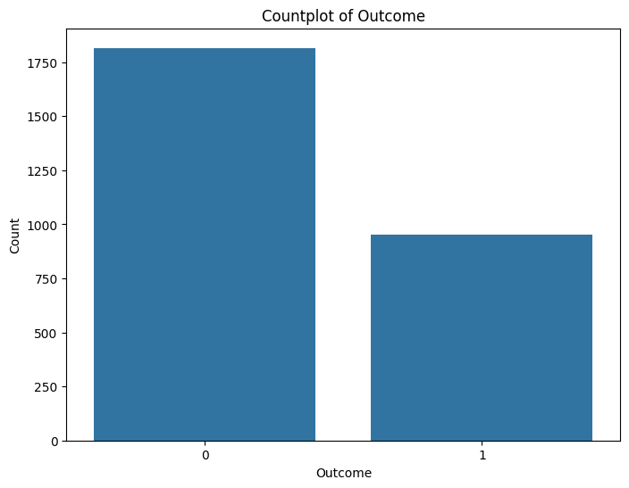
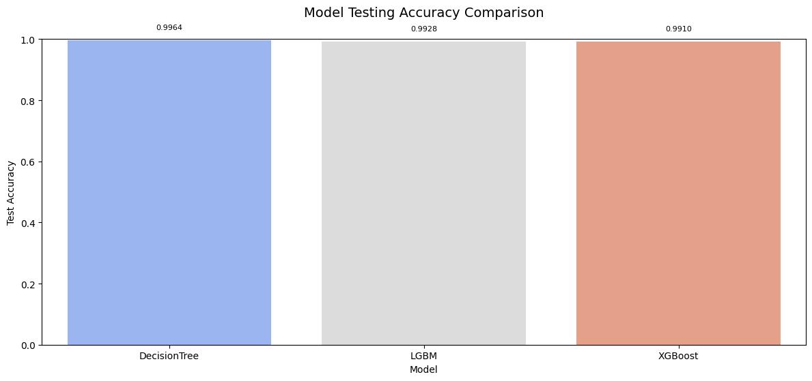

# Laporan Proyek Machine Learning - I Dewa Gede Mahesta Parawangsa

## Domain Proyek

### Latar Belakang

Kesehatan masyarakat global tengah menghadapi tantangan serius akibat meningkatnya prevalensi penyakit tidak Diabetes melitus (DM) merupakan salah satu penyakit tidak menular yang menjadi tantangan serius bagi kesehatan masyarakat global [1]. Menurut Organisasi Kesehatan Dunia (WHO), sekitar 422 juta orang di seluruh dunia hidup dengan kondisi ini, dengan mayoritas kasus terkonsentrasi di negara berpenghasilan rendah dan menengah. Angka prevalensi ini diperkirakan akan terus meningkat di masa mendatang. Beban penyakit ini tidak hanya dirasakan oleh individu penderita, yang berisiko mengalami komplikasi berat seperti penyakit jantung, stroke, dan gagal ginjal, tetapi juga oleh sistem kesehatan secara keseluruhan [1]. Skala masalah ini semakin nyata jika melihat data Federasi Diabetes Internasional (IDF), yang mencatat sekitar 463 juta orang hidup dengan diabetes pada tahun 2019 dan memproyeksikan angka ini melonjak hingga 700 juta jiwa pada tahun 2045 [2]. Mengingat tren yang mengkhawatirkan ini, kemampuan untuk mendeteksi risiko diabetes sedini mungkin menjadi kunci utama, memungkinkan penerapan intervensi preventif atau terapeutik secara tepat waktu untuk menekan laju penyakit dan komplikasinya [3].

Permasalahan mendasar yang mendorong penelitian ini adalah keterbatasan dalam memprediksi risiko diabetes secara akurat dan efisien pada tahap awal. Seringkali, diabetes berkembang tanpa gejala yang jelas (asimptomatik) pada fase awalnya, menyebabkan diagnosis baru ditegakkan setelah penyakit berkembang cukup lanjut atau bahkan ketika komplikasi sudah mulai muncul [4]. Keterlambatan diagnosis ini sebagian disebabkan oleh kurangnya akses terhadap alat skrining atau prediksi risiko yang efektif dan mudah dijangkau. Selain itu, pendekatan diagnostik konvensional yang mengandalkan pemeriksaan klinis dan laboratorium secara manual dapat memakan waktu dan biaya yang tidak sedikit, menjadi penghalang bagi deteksi dini berskala luas [4].

Seiring dengan ledakan data kesehatan digital dalam beberapa tahun terakhir, muncul peluang besar untuk mengatasi tantangan ini [5]. Namun, potensi data tersebut belum dimanfaatkan secara optimal untuk prediksi risiko diabetes. Penyebab utamanya adalah kompleksitas faktor risiko yang terlibat dan bagaimana mereka berinteraksi. Berbagai faktor seperti **riwayat kehamilan**, **kadar glukosa dan insulin dalam tubuh**, **tekanan darah**, **pengukuran komposisi tubuh seperti ketebalan lipatan kulit dan indeks massa tubuh**, **faktor keturunan atau predisposisi genetik**, serta **usia**—semuanya berkontribusi dan saling mempengaruhi dalam menentukan status atau kerentanan seseorang terhadap diabetes [6]. Menganalisis hubungan multifaktorial yang rumit dari data semacam ini seringkali melampaui kemampuan analisis konvensional. Di sinilah letak urgensi penyelesaian masalah: kegagalan mendeteksi risiko secara dini berdasarkan kombinasi faktor-faktor ini akan terus berkontribusi pada peningkatan beban penyakit diabetes dan komplikasinya, baik bagi individu maupun sistem kesehatan secara keseluruhan.

Oleh karena itu, penerapan teknologi berbasis data, khususnya pendekatan **pembelajaran mesin (machine learning)**, menjadi sangat relevan dan mendesak. Metode komputasi ini dirancang untuk mengolah dataset bervolume besar dan mengidentifikasi pola-pola kompleks yang mungkin terlewat oleh analisis manual [7]. Dengan melatih model prediktif menggunakan data riwayat kesehatan pasien, kita dapat mengembangkan alat bantu skrining yang mampu mengestimasi probabilitas risiko diabetes pada individu berdasarkan profil faktor risikonya. Pendekatan ini tidak hanya berpotensi meningkatkan akurasi dan kecepatan deteksi dini, tetapi juga dapat memberikan wawasan baru mengenai faktor-faktor mana yang paling signifikan dalam memprediksi risiko diabetes pada populasi tertentu [8]. Model prediktif yang andal dan mudah diinterpretasikan diharapkan dapat menjadi alat bantu berharga bagi tenaga medis dalam pengambilan keputusan klinis, memungkinkan intervensi yang lebih tepat sasaran dan personal.

Tujuan dari project ini adalah untuk mengembangkan dan mengevaluasi sebuah model prediktif risiko diabetes menggunakan algoritma machine learning. Kinerja model akan dinilai berdasarkan metrik standar seperti akurasi, sensitivitas, dan spesifisitas. Harapannya, model yang dihasilkan dapat memberikan kontribusi praktis dalam upaya deteksi dini diabetes, mendukung sistem kesehatan dalam mengidentifikasi individu berisiko tinggi, serta memperkaya pemahaman mengenai faktor-faktor kunci pemicu diabetes.

---

**Referensi:**

1.  [World Health Organization, "Diabetes," 2023 [Online].](https://www.who.int/news-room/fact-sheets/detail/diabetes ) 
2.  [IDF Diabetes Atlas 9th Edition Statistics](https://www.diabetesatlas.org/)
3.  [American Diabetes Association. (2020). Diagnosis and classification of diabetes mellitus. Diabetes Care, 43(Suppl. 1), S14–S31.](https://doi.org/10.2337/dc20-S002)
4.  [F. Johnson and L. White, "Application of Data Mining in Health Sector: A Review of Literature", International Journal of Advanced Computer Science and Applications, vol. 11, no. 5, pp. 175-183, 2020.](https://thesai.org/Publications/IJACSA)
5.  [J. Han, M. Kamber, and J. Pei, Data Mining: Concepts and Techniques, 3rd ed. Waltham: Morgan Kaufmann, 2018. ](https://www.sciencedirect.com/book/9780123814791/data-mining-concepts-and-techniques) 
6.  [Sisodia, D., & Sisodia, D. S. (2018). Prediction of diabetes using classification algorithms. Procedia Computer Science, 132, 1578–1585.](https://www.sciencedirect.com/science/article/pii/S1877050918308548?via%3Dihub) 
7.  [Fadhlullah, A. F., & Widiyaningtyas, T. (2024). Comparative analysis of decision tree and random forest algorithms for diabetes prediction. JTAM (Jurnal Teori dan Aplikasi Matematika), 8(4), 1121–1132.](http://journal.ummat.ac.id/index.php/jtam) 
8.  [Ismafillah, D., Rohana, T., & Cahyana, Y. (2023). Analisis algoritma pohon keputusan untuk memprediksi penyakit diabetes menggunakan oversampling SMOTE. INFOTECH: Jurnal Informatika Teknologi, 4(1), 27–36.](https://www.researchgate.net/publication/371963606_Analisis_algoritma_pohon_keputusan_untuk_memprediksi_penyakit_diabetes_menggunakan_oversampling_smote)

**Solution Statement**:
1. **Beban penyakit dan komplikasi tinggi**  
   - Diabetes melitus memengaruhi sekitar 422 juta orang di seluruh dunia, dengan peningkatan paling cepat di negara berpenghasilan rendah dan menengah.  
   - Pada 2019 tercatat 463 juta kasus, dan diproyeksikan mencapai 700 juta pada 2045 jika tidak ada intervensi efektif.

2. **Keterbatasan skrining konvensional**  
   - Banyak kasus diabetes tipe 2 bersifat asimptomatik sehingga sering baru terdiagnosis saat komplikasi sudah muncul.  
   - Meta‑analisis menunjukkan HbA₁c hanya memiliki sensitivitas rata‑rata 49 % dan spesifisitas 79 % untuk mendeteksi pra‑diabetes.  
   - Rekomendasi skrining asimptomatik (misalnya setiap 3 tahun) jarang diterapkan konsisten, terutama di wilayah sumber daya terbatas.

3. **Potensi machine learning untuk deteksi dini**  
   - Algoritma ML mampu mengolah dataset besar dan memodelkan interaksi kompleks faktor risiko (glukosa, tekanan darah, BMI, genetik, dll.).  
   - Ulasan sistematis menunjukkan model machine learning umumnya mengungguli metode statistik tradisional dalam prediksi diabetes.
  
  Format Referensi: [Prediksi Penyakit Diabetes Menggunakan Algoritma Support Vector Machine (SVM)](https://pdfs.semanticscholar.org/28fd/32b134f3333078fe770e67cf972e8584b349.pdf) 

## Business Understanding

### Problem Statements

Berdasarkan latar belakang yang telah dipaparkan sebelumnya, berikut adalah pernyataan masalah utama yang diidentifikasi:

*   **Pernyataan Masalah 1:** **Beban Kesehatan Masyarakat Akibat Diabetes yang Tinggi dan Sulit Dikendalikan:** Prevalensi diabetes melitus secara global sangat tinggi dan terus meningkat, menimbulkan beban signifikan pada sistem kesehatan dan individu karena risiko komplikasi serius (seperti penyakit jantung, kerusakan saraf, gagal ginjal) yang dapat dicegah atau diminimalkan dengan deteksi dan manajemen dini.
*   **Pernyataan Masalah 2:** **Keterbatasan Deteksi Dini Risiko Diabetes:** Terdapat keterbatasan signifikan dalam mengidentifikasi individu yang berisiko tinggi terkena diabetes pada tahap awal. Hal ini disebabkan oleh sifat penyakit yang seringkali berkembang tanpa gejala jelas, serta kurangnya akses terhadap metode skrining atau prediksi risiko yang akurat, cepat, dan efisien secara biaya dibandingkan pendekatan diagnostik konvensional.
*   **Pernyataan Masalah 3:** **Kompleksitas Analisis Faktor Risiko dan Kurangnya Pemanfaatan Data:** Risiko diabetes dipengaruhi oleh interaksi kompleks berbagai faktor (termasuk riwayat kehamilan, kadar glukosa, tekanan darah, komposisi tubuh, usia, dan predisposisi genetik). Metode analisis konvensional seringkali kesulitan menangkap hubungan multifaktorial ini secara efektif, sehingga potensi data kesehatan digital yang besar belum dimanfaatkan secara optimal untuk mengembangkan model prediksi risiko yang andal dan dapat ditindaklanjuti.

### Goals

Berdasarkan pernyataan masalah tersebut, tujuan utama dari proyek ini diantaranya:

*   Mengembangkan model prediktif yang akurat untuk membantu identifikasi dini individu berisiko tinggi terkena diabetes. Dengan deteksi dini, intervensi preventif atau pengelolaan penyakit dapat dilakukan lebih awal, yang berpotensi mengurangi laju perkembangan penyakit menuju komplikasi serius dan pada akhirnya membantu meringankan beban kesehatan masyarakat jangka panjang.
*   Mengatasi Keterbatasan Deteksi dengan Menyediakan metode yang dapat membantu prediksi risiko diabetes berbasis data yang lebih efektif dibandingkan pendekatan skrining konvensional atau analisis manual. Efektivitas ini diukur dari kemampuan model dalam memberikan prediksi yang akurat (tinggi dalam mengidentifikasi kasus positif dan negatif secara benar) dan potensi skalabilitasnya untuk digunakan pada populasi yang lebih luas.
*   Memanfaatkan Data & Mengatasi Kompleksitas (dengan fitur-fitur relevan seperti Glukosa, BMI, Usia, dll.) untuk membangun model machine learning yang mampu **menangkap pola kompleks dan mengidentifikasi faktor-faktor risiko paling signifikan** yang berkontribusi terhadap prediksi diabetes. Ini akan memberikan wawasan berbasis bukti tentang pendorong utama risiko dalam dataset yang digunakan.

### Solution Statements
Untuk mencapai tujuan-tujuan tersebut, berikut adalah solusi teknis terukur yang diajukan:

1.  **Eksplorasi Data (Exploratory Data Analysis - EDA):** Sebelum model dilatih, Analisis Data Eksploratif (EDA) akan dilakukan untuk memahami karakteristik data. EDA ini membantu dalam identifikasi pola, pemeriksaan hubungan antar variabel, dan penemuan wawasan yang berguna untuk prediksi diabetes.
2.  **Penggunaan Library Lazypredict:** Library `Lazypredict` akan dimanfaatkan untuk secara cepat mengevaluasi dan membandingkan kinerja berbagai model machine learning pada dataset ini. `Lazypredict` memungkinkan pelatihan puluhan model klasifikasi (atau regresi, tergantung tugasnya) secara otomatis dengan hanya beberapa baris kode. Library ini kemudian menyajikan ringkasan performa (seperti akurasi, F1-score, dll.) untuk setiap model yang diuji pada dataset yang diberikan. Dengan menggunakan `Lazypredict`, kita dapat dengan efisien mendapatkan gambaran awal mengenai algoritma mana yang paling potensial atau berkinerja baik untuk dataset spesifik ini, tanpa perlu menulis kode boilerplate untuk setiap model secara manual. Hal ini mempercepat proses pemilihan model awal sebelum melakukan eksplorasi atau penyesuaian parameter (hyperparameter tuning) yang lebih mendalam pada beberapa model kandidat terbaik.
3.  **Pengembangan dan Evaluasi Model Klasifikasi:** Mengembangkan model prediksi risiko diabetes menggunakan **algoritma machine learning** seperti *Decision Tree* dan *Gradient Boosting* sebagai *baseline* pada dataset yang tersedia. Kinerja model ini akan dievaluasi secara komprehensif menggunakan metrik evaluasi standar klasifikasi biner, termasuk **Akurasi**, **Presisi**, **Recall**, dan **F1-Score**. Fokus khusus akan diberikan pada metrik *Recall* untuk memastikan kemampuan model dalam mengidentifikasi sebanyak mungkin kasus diabetes aktual (meminimalkan *false negatives*).
2.  **Eksplorasi dan Optimasi Model dengan  GridSearchCV:** Melakukan **perbandingan kinerja** antara model baseline dengan **algoritma Machine Learning** bervariasi yang dikenal memiliki performa baik untuk tugas klasifikasi seperti *Decision tree* dan *Gradient Boosting* untuk mengidentifikasi pendekatan yang mungkin memberikan hasil prediksi terbaik pada dataset ini. Selain itu, akan dilakukan **optimasi hyperparameter** pada model terpilih menggunakan teknik seperti *Grid Search* untuk memaksimalkan performa prediktifnya. Peningkatan kinerja akan diukur berdasarkan perbaikan pada metrik evaluasi yang sama (Akurasi, Presisi, Recall, F1-Score).

## Data Understanding

Dataset yang digunakan dalam proyek ini dapat dianalogikan dengan dataset yang sering digunakan dalam penelitian diabetes, seperti yang tersedia di repositori publik. Untuk informasi lebih lanjut mengenai diabetes: [National Institute of Diabetes and Digestive and Kidney Diseases (NIDDK)](https://www.niddk.nih.gov/health-information/diabetes)

Dataset dapat diunduh melalui: [Healthcare Diabetes Dataset](https://www.kaggle.com/datasets/nanditapore/healthcare-diabetes/data)

## 6. Data Understanding

Bagian ini berisi pemahaman dasar mengenai dataset yang digunakan.

### Informasi Dataset

Berikut adalah ringkasan informasi mengenai struktur dan tipe data dalam dataset:

*   Dataset ini memiliki **2768 sampel** (baris data).
*   Terdapat **10 fitur** (kolom) dalam dataset, termasuk fitur target `Outcome`.
*   Dataset terdiri dari **8 fitur** dengan tipe data `int64` dan **2 fitur** dengan tipe data `float64`.
*   Dataset memiliki format CSV (Comma-Seperated Values).

### Sample Data:

| Metric                   | Id        | Pregnancies | Glucose | BloodPressure | SkinThickness | Insulin | BMI   | DiabetesPedigreeFunction | Age   | Outcome |
| :----------------------- | :-------- | :---------- | :------ | :------------ | :------------ | :------ | :---- | :----------------------- | :---- | :------ |
| **count**                | 2768      | 2768        | 2768    | 2768          | 2768          | 2768    | 2768  | 2768                     | 2768  | 2768    |
| **mean**                 | 1384.50   | 3.74        | 121.10  | 69.13         | 20.82         | 80.13   | 32.14 | 0.47                     | 33.13 | 0.34    |
| **std**                  | 799.20    | 3.32        | 32.04   | 19.23         | 16.06         | 112.30  | 8.08  | 0.33                     | 11.78 | 0.48    |
| **min**                  | 1         | 0           | 0       | 0             | 0             | 0       | 0.00  | 0.08                     | 21    | 0       |
| **25%**                  | 692.75    | 1           | 99      | 62            | 0             | 0       | 27.30 | 0.24                     | 24    | 0       |
| **50%**                  | 1384.50   | 3           | 117     | 72            | 23            | 37      | 32.20 | 0.38                     | 29    | 0       |
| **75%**                  | 2076.25   | 6           | 141     | 80            | 32            | 130     | 36.62 | 0.62                     | 40    | 1       |
| **max**                  | 2768      | 17          | 199     | 122           | 110           | 846     | 80.60 | 2.42                     | 81    | 1       |

### Variabel-variabel pada Dataset Diabetes adalah sebagai berikut:

*   **Id:** Pengenal unik (unique identifier) untuk setiap baris atau entri data pasien.
*   **Pregnancies:** Jumlah berapa kali seorang pasien pernah hamil.
*   **Glucose:** Konsentrasi glukosa plasma setelah 2 jam menjalani tes toleransi glukosa oral (OGTT). Ini adalah indikator penting kemampuan tubuh memproses gula.
*   **BloodPressure:** Tekanan darah diastolik (angka bawah saat pengukuran tekanan darah), diukur dalam milimeter air raksa (mm Hg).
*   **SkinThickness:** Ketebalan lipatan kulit pada area trisep (lengan atas bagian belakang), diukur dalam milimeter (mm). Pengukuran ini dapat berkaitan dengan jumlah lemak tubuh.
*   **Insulin:** Kadar insulin dalam serum darah setelah 2 jam (biasanya terkait dengan tes OGTT), diukur dalam micro international units per milliliter (mu U/ml). Insulin adalah hormon pengatur gula darah.
*   **BMI:** Indeks Massa Tubuh (Body Mass Index), dihitung sebagai berat badan dalam kilogram dibagi dengan kuadrat tinggi badan dalam meter (kg/m²). Ini adalah ukuran umum untuk status berat badan (kurus, normal, berlebih, obesitas).
*   **DiabetesPedigreeFunction:** Fungsi silsilah diabetes, sebuah skor yang merepresentasikan kemungkinan risiko diabetes berdasarkan riwayat diabetes dalam keluarga (faktor genetik). Nilai yang lebih tinggi menunjukkan risiko genetik yang lebih besar.
*   **Age:** Usia pasien saat data dicatat, dalam satuan tahun.
*   **Outcome:** Variabel target (kelas) yang bersifat biner. Nilai `1` menunjukkan bahwa pasien didiagnosis menderita diabetes, sedangkan nilai `0` menunjukkan bahwa pasien tidak menderita diabetes. Variabel inilah yang akan diprediksi oleh model.

### Pendalaman Data Understanding

Tahapan Analisis Data Eksploratif (EDA) yang lebih mendalam akan dilakukan untuk memahami data secara komprehensif. Proses ini meliputi beberapa langkah kunci:

*   **Deskripsi Variabel:** Mendeskripsikan karakteristik dasar dari setiap variabel (fitur) dalam dataset untuk memahami makna dan cakupan nilainya.
*   **Analisis Outlier:** Mengidentifikasi adanya nilai pencilan (outliers) pada fitur numerik. Ini akan dilakukan terutama menggunakan visualisasi *boxplot*, yang dapat dihasilkan dengan memanggil fungsi `.plot(kind='box')` pada objek `pandas` DataFrame atau Series terkait.
*   **Analisis Tipe Fitur:** Melakukan analisis terpisah untuk fitur kategorikal dan numerikal guna memahami properti dan distribusi data pada masing-masing tipe fitur tersebut.
*   **Pemeriksaan dan Penanganan Missing Value:** Mengecek kembali keberadaan data yang hilang (missing values). Jika ditemukan, akan dibuat logika atau strategi penanganan sederhana (seperti imputasi atau penghapusan) untuk membersihkan data.
*   **Visualisasi Distribusi Data:** Memvisualisasikan pola sebaran (distribusi) data pada fitur-fitur numerik menggunakan *histogram*. Histogram akan mudah dibuat menggunakan fungsi `.hist()` yang disediakan oleh library `pandas`.
*   **Analisis Korelasi Fitur:** Menganalisis tingkat keterkaitan atau hubungan linear antar fitur numerik. Ini dilakukan dengan menghitung matriks korelasi menggunakan fungsi `.corr()` dari `pandas`. Untuk mempermudah interpretasi pola korelasi, matriks ini akan divisualisasikan dalam bentuk *heatmap* menggunakan library `seaborn`. Analisis ini juga dapat membantu memahami hubungan antara fitur numerik dan fitur target (jika kategorikal, meskipun heatmap utama fokus pada numerik-numerik).

### Deteksi Outlier Menggunakan Metode IQR dan Visualisasi Boxplot

Untuk mengidentifikasi dan menangani nilai pencilan (outlier) dalam data, salah satu pendekatan statistik yang umum digunakan adalah metode **Interquartile Range (IQR)**. Visualisasi yang sangat efektif untuk mendukung metode ini adalah **boxplot**. **Selain menggunakan metode standar IQR, penanganan outlier pada beberapa fitur juga dilakukan dengan mempertimbangkan kustomisasi berdasarkan standar nilai normal kesehatan dalam kehidupan nyata, merujuk pada informasi atau riset dari sumber data (website) yang digunakan.**

#### Metode IQR (Interquartile Range)

*   **Konsep:** IQR adalah ukuran penyebaran statistik yang fokus pada 50% data di tengah distribusi. IQR dihitung sebagai selisih antara **Kuartil Ketiga (Q3)**, yang merupakan nilai batas 75% data, dan **Kuartil Pertama (Q1)**, yang merupakan nilai batas 25% data. Nilai yang berada secara signifikan di luar rentang ini dianggap sebagai outlier potensial.

*   **Langkah-langkah Perhitungan Batas Outlier:**
    1.  Hitung **Kuartil Pertama (Q1)** dari data.
    2.  Hitung **Kuartil Ketiga (Q3)** dari data.
    3.  Hitung nilai **IQR** dengan rumus: `IQR = Q3 - Q1`.
    4.  Tentukan **Batas Bawah** untuk outlier: `Batas Bawah = Q1 - (1.5 * IQR)`.
    5.  Tentukan **Batas Atas** untuk outlier: `Batas Atas = Q3 + (1.5 * IQR)`.
    6.  Setiap titik data yang nilainya lebih kecil dari **Batas Bawah** atau lebih besar dari **Batas Atas** diidentifikasi sebagai **outlier** menurut kriteria IQR standar.

#### Visualisasi Boxplot

*   **Konsep:** *Boxplot* (atau diagram kotak garis) adalah representasi grafis ringkas dari distribusi data numerik. Visualisasi ini sangat berguna untuk memahami penyebaran data, tendensi sentral, dan terutama untuk mengidentifikasi keberadaan outlier secara visual berdasarkan metode IQR.

*   **Interpretasi Komponen Boxplot:**
    *   **Kotak (Box):** Merepresentasikan rentang **IQR**, dimulai dari **Q1** (batas bawah kotak) hingga **Q3** (batas atas kotak). Panjang kotak ini adalah nilai IQR.
    *   **Garis Median:** Garis di dalam kotak yang menandakan nilai **Median** (Q2 atau persentil ke-50) dari data.
    *   **Whisker (Kumis):** Garis yang memanjang dari kotak. Umumnya, whisker atas memanjang hingga nilai data terbesar yang masih berada dalam `Q3 + (1.5 * IQR)`, dan whisker bawah memanjang hingga nilai data terkecil yang masih berada dalam `Q1 - (1.5 * IQR)`.
    *   **Titik Outlier:** Titik-titik data individual yang digambarkan di luar jangkauan *whisker*. Titik-titik inilah yang diidentifikasi sebagai **outlier** berdasarkan kriteria IQR (1.5 kali IQR di bawah Q1 atau di atas Q3).

Setelah mengidentifikasi potensi outlier menggunakan metode IQR dan visualisasi *boxplot* (serta mempertimbangkan standar kesehatan jika relevan), langkah selanjutnya adalah menentukan cara menanganinya. Outlier, sebagai nilai ekstrem atau tidak biasa, berpotensi memengaruhi keakuratan analisis statistik dan kinerja model prediktif yang akan dibangun.

Dengan memahami batas atas dan batas bawah yang dihitung melalui IQR (dan divalidasi oleh *boxplot* serta pengetahuan domain), kita dapat mengambil tindakan yang sesuai. Opsi penanganan bisa meliputi:

*   **Penghapusan (Removal):** Menghilangkan observasi yang mengandung outlier, terutama jika outlier tersebut jelas merupakan kesalahan input atau anomali yang tidak representatif.
*   **Transformasi (Transformation):** Menerapkan fungsi matematika (seperti logaritma) pada fitur untuk mengurangi dampak nilai ekstrem.
*   **Capping/Winsorizing:** Mengganti nilai outlier dengan nilai batas atas atau batas bawah yang telah ditentukan (misalnya, mengganti semua nilai di atas `Q3 + 1.5*IQR` dengan nilai `Q3 + 1.5*IQR`).
*   **Imputasi (Imputation):** Memperlakukan outlier sebagai *missing value* dan mengisinya dengan nilai statistik lain (seperti median atau mean).

Keputusan mengenai metode penanganan outlier harus didasarkan pada pemahaman data dan tujuan analisis agar tidak menghilangkan informasi penting atau secara signifikan mengubah karakteristik asli dataset.

### Analisis Sebaran Data Menggunakan Histogram

Untuk menganalisis bagaimana nilai-nilai dalam setiap fitur numerik tersebar (distribusinya), kita dapat menggunakan **histogram**. Histogram adalah visualisasi grafis yang efektif untuk menampilkan distribusi frekuensi data dalam interval-interval tertentu (disebut *bins*).

#### Proses Pembuatan dan Interpretasi Histogram:

1.  **Pembagian Data ke dalam Interval (Binning):**
    *   Data pada suatu fitur dibagi menjadi serangkaian interval atau *bin* yang tidak tumpang tindih.
    *   Jumlah dan lebar *bin* dapat ditentukan secara otomatis oleh library visualisasi (seperti `pandas` atau `matplotlib`), atau dapat diatur secara manual. Aturan seperti *Sturges* atau *Scott's rule* dapat menjadi panduan dalam menentukan jumlah *bin* yang optimal.

2.  **Perhitungan Frekuensi:**
    *   Dihitung berapa banyak titik data (observasi) yang nilainya jatuh ke dalam masing-masing *bin*.

3.  **Visualisasi:**
    *   Histogram digambarkan sebagai serangkaian batang (bars) yang saling bersentuhan.
    *   Sumbu horizontal (x-axis) merepresentasikan interval atau *bin*.
    *   Sumbu vertikal (y-axis) merepresentasikan frekuensi (jumlah observasi) dalam setiap *bin*. Tinggi batang menunjukkan frekuensi tersebut.

4.  **Interpretasi Visual:**
    *   Dengan mengamati bentuk histogram, kita dapat memahami pola distribusi data secara visual:
        *   **Bentuk Distribusi:** Apakah data cenderung simetris (misalnya, mendekati distribusi normal/Gaussian/lonceng), miring ke kanan (*right-skewed*), miring ke kiri (*left-skewed*), atau memiliki lebih dari satu puncak (*bimodal* atau *multimodal*)?
        *   **Tendensi Sentral:** Di mana sebagian besar data terkonsentrasi?
        *   **Penyebaran:** Seberapa luas rentang nilai data?
        *   **Potensi Outlier:** Adanya batang yang terisolasi jauh dari kelompok utama dapat mengindikasikan adanya outlier.

Analisis distribusi menggunakan histogram merupakan langkah penting dalam EDA. Ini memberikan pemahaman cepat mengenai karakteristik dasar setiap fitur numerik, membantu mengidentifikasi potensi masalah data (seperti kemiringan ekstrem), dan memberikan informasi yang berguna sebelum melanjutkan ke analisis yang lebih kompleks atau pembangunan model.

*Interpretasi: Plot ini menunjukkan distribusi jumlah pasien dalam dataset berdasarkan status diabetes (Outcome). Terlihat jelas bahwa jumlah pasien yang tidak menderita diabetes (Outcome 0 = 1816) secara signifikan lebih banyak dibandingkan dengan pasien yang menderita diabetes (Outcome 1 = 952). Hal ini mengindikasikan adanya ketidakseimbangan kelas dalam dataset.*

*Interpretasi: Grid ini menampilkan distribusi (histogram) dan potensi outlier (boxplot) untuk setiap fitur numerik sebelum proses pembersihan outlier. Boxplot mengindikasikan adanya nilai-nilai pencilan (titik di luar whisker) pada beberapa fitur seperti `BloodPressure`, `SkinThickness`, `Insulin`, `BMI`, `Age`, dan `DiabetesPedigreeFunction`. Histogram menunjukkan variasi bentuk distribusi, banyak di antaranya cenderung miring ke kanan (right-skewed) seperti `Age`, `Insulin`, dan `Pregnancies`.*

*Interpretasi: Grid ini menampilkan distribusi dan boxplot fitur numerik setelah dilakukan penghapusan outlier menggunakan batas kustom yang ditentukan (bukan murni metode IQR) untuk fitur `BloodPressure`, `SkinThickness`, `Insulin`, `BMI`, dan `Age`. Berdasarkan output kode, outlier signifikan pada `SkinThickness` (nilai > 100), `Insulin` (nilai > 850), dan `BMI` (nilai > 70) telah dihapus sesuai batas tersebut, menghasilkan boxplot yang lebih 'bersih' untuk fitur-fitur ini. Tidak ada outlier yang dihapus untuk `BloodPressure` dan `Age` berdasarkan batas kustom yang digunakan.*

*Interpretasi: Pairplot ini memvisualisasikan hubungan antar pasangan fitur numerik (melalui scatter plot) dan distribusi masing-masing fitur (melalui plot kepadatan/KDE di diagonal). Dari scatter plot, dapat diamati adanya potensi hubungan positif antara beberapa fitur, misalnya antara `BMI` dan `SkinThickness`, serta `Glucose` dan `Insulin`. Namun, banyak juga pasangan fitur yang menunjukkan hubungan lemah atau non-linear. Plot diagonal mengkonfirmasi bentuk distribusi yang bervariasi seperti yang terlihat pada histogram sebelumnya.*

### Analisis Hubungan Antar Fitur Menggunakan Matriks Korelasi dan Heatmap

Untuk memahami bagaimana fitur-fitur dalam dataset saling berkaitan, khususnya hubungan linear antara **fitur-fitur numerik**, kita dapat menggunakan **matriks korelasi**. Matriks ini dihitung menggunakan fungsi `.corr()` dari library `pandas`.

Agar pola hubungan ini lebih mudah diinterpretasikan secara visual, matriks korelasi tersebut seringkali disajikan dalam bentuk **heatmap** menggunakan library `seaborn`.

*   **Visualisasi Heatmap:**
    *   *Heatmap* menyajikan matriks korelasi dalam bentuk grid berwarna.
    *   Setiap sel dalam grid menunjukkan koefisien korelasi antara sepasang fitur.
    *   Intensitas dan nuansa warna dalam *heatmap* (sesuai *colormap* yang dipilih) secara visual merepresentasikan **kekuatan** dan **arah** korelasi:
        *   Nilai mendekati **+1** (seringkali diwakili warna terang/panas tertentu) menunjukkan **korelasi positif yang kuat** (jika satu fitur naik, fitur lain cenderung naik).
        *   Nilai mendekati **-1** (seringkali diwakili warna terang/panas lain atau warna kontras) menunjukkan **korelasi negatif yang kuat** (jika satu fitur naik, fitur lain cenderung turun).
        *   Nilai mendekati **0** (seringkali diwakili warna netral/gelap) menunjukkan **korelasi linear yang lemah atau tidak ada**.

*   **Manfaat Analisis Korelasi:**
    *   Mengidentifikasi fitur mana yang memiliki hubungan linear kuat satu sama lain (indikasi potensi **multikolinearitas**).
    *   Melihat fitur numerik mana yang memiliki korelasi paling signifikan (positif atau negatif) dengan **variabel target** (dalam kasus ini, `Outcome`, yang meskipun kategorikal (0/1), dapat dihitung korelasinya [Point-Biserial] dengan fitur numerik).
    *   Memberikan wawasan awal yang berguna untuk tahap selanjutnya seperti **pemilihan fitur** (*feature selection*) atau rekayasa fitur (*feature engineering*).

*Interpretasi: Heatmap ini menunjukkan koefisien korelasi linear antar semua fitur numerik, termasuk target (`Outcome`). Fokus pada kolom atau baris 'Outcome', kita dapat melihat bahwa:
    *   **Glucose** (0.49) memiliki korelasi positif **paling kuat** dengan `Outcome`, menunjukkan bahwa kadar glukosa yang lebih tinggi secara linear sangat berkaitan dengan kemungkinan diagnosis diabetes.
    *   Fitur lain seperti **Insulin** (0.35), **BMI** (0.30), **SkinThickness** (0.28), **Age** (0.24), dan **Pregnancies** (0.22) juga menunjukkan korelasi positif yang moderat hingga lemah dengan `Outcome`. Artinya, peningkatan nilai pada fitur-fitur ini cenderung berhubungan dengan peningkatan kemungkinan diabetes.
    *   **DiabetesPedigreeFunction** (0.16) dan **BloodPressure** (0.18) menunjukkan korelasi positif yang **paling lemah** dengan `Outcome` di antara semua fitur.
Secara keseluruhan, hampir semua fitur menunjukkan korelasi positif dengan `Outcome`, namun `Glucose` adalah prediktor linear terkuat.*

## Data Preparation

Tahap persiapan data (Data Preparation) sangat krusial untuk memastikan kualitas dan kesesuaian data sebelum digunakan untuk melatih model machine learning yang efektif dan andal. Proses ini membantu mengatasi masalah umum dalam data mentah seperti nilai yang hilang, data duplikat, outlier, dan format data yang tidak sesuai untuk algoritma machine learning. Berdasarkan analisis kode yang dijalankan, berikut adalah langkah-langkah persiapan data yang dilakukan pada dataset diabetes ini:

### Pemisahan Fitur (Features) dan Target

*   **Proses:** Variabel independen (fitur/prediktor) yang akan digunakan sebagai input model (seperti `Glucose`, `BMI`, `Age`, dll.) dipisahkan dari variabel dependen (target/label) yang ingin diprediksi (`Outcome`). Kolom identifikasi unik (`Id`) yang tidak relevan untuk pemodelan juga dihapus dari himpunan fitur. Fitur disimpan dalam variabel `X`, dan target disimpan dalam variabel `y`.
*   Langkah ini fundamental karena algoritma supervised machine learning memerlukan input (fitur `X`) dan output yang diharapkan (target `y`) secara terpisah. Model belajar dari hubungan antara `X` dan `y` pada data training untuk nantinya dapat memprediksi `y` dari `X` yang baru. Kolom `Id` dihapus karena tidak memiliki nilai prediktif terhadap `Outcome`.

### Pembagian Dataset 80:20 (Train/Test Split)

*   **Proses:**
    1.  Keseluruhan dataset (`X` dan `y`) dibagi menjadi dua himpunan terpisah: data training dan data testing.
    2.  Fungsi `train_test_split` dari `sklearn.model_selection` digunakan untuk melakukan pembagian ini secara acak namun terkontrol (menggunakan `random_state=42` untuk reproduktibilitas) dengan rasio **80:20**.
    3.  Hasil pembagian ini menghasilkan dimensi data sebagai berikut:
        *   `X_train`: (2208 sampel, 8 fitur) - Data fitur untuk melatih model.
        *   `X_test`: (553 sampel, 8 fitur) - Data fitur untuk menguji model.
        *   `y_train`: (2208 sampel,) - Data target untuk melatih model.
        *   `y_test`: (553 sampel,) - Data target untuk menguji model.
*   Pembagian ini sangat penting untuk **evaluasi performa model yang objektif**. Data training digunakan agar model dapat 'belajar' pola dari data. Data testing, yang **tidak pernah dilihat** oleh model selama pelatihan, digunakan untuk menguji seberapa baik model dapat **menggeneralisasi** pengetahuannya ke data baru. Tanpa pemisahan ini, kita tidak dapat mengetahui apakah model hanya menghafal data training (*overfitting*) atau benar-benar mempelajari pola yang berguna. Rasio 80:20 adalah praktik umum yang memberikan cukup data untuk pelatihan sambil menyisakan porsi yang representatif untuk pengujian.

### Penanganan Ketidakseimbangan Kelas (Class Imbalance) dengan SMOTE

*   **Proses:** Teknik **SMOTE (Synthetic Minority Over-sampling Technique)** diterapkan **hanya pada data training** (`X_train`, `y_train`). SMOTE bekerja dengan cara membuat sampel sintetis baru untuk kelas minoritas (`Outcome` = 1, yaitu pasien diabetes) berdasarkan karakteristik sampel minoritas yang sudah ada, sehingga jumlah sampel kelas minoritas mendekati jumlah sampel kelas mayoritas (`Outcome` = 0) dalam set pelatihan.
*   Analisis awal menunjukkan bahwa jumlah pasien non-diabetes (`Outcome` = 0) jauh lebih banyak daripada pasien diabetes (`Outcome` = 1) dalam dataset (ketidakseimbangan kelas). Jika dibiarkan, model machine learning cenderung **menjadi bias** dan lebih baik dalam memprediksi kelas mayoritas, sementara performanya buruk dalam mengidentifikasi kelas minoritas (yang seringkali lebih penting dalam konteks medis). Dengan menyeimbangkan kelas menggunakan SMOTE pada data training, kita membantu model **memberikan perhatian yang lebih setara** pada kedua kelas dan meningkatkan kemampuannya untuk mengenali pola pada pasien diabetes. Penting untuk menerapkan SMOTE *hanya* pada data training untuk **mencegah kebocoran data** (*data leakage*) dan memastikan evaluasi pada data testing mencerminkan performa model pada distribusi data dunia nyata yang tidak seimbang.

## Modeling

Tahapan modeling adalah inti dari proyek machine learning ini, di mana algoritma dipilih, dilatih, dan dioptimalkan untuk melakukan prediksi `Outcome` (apakah pasien menderita diabetes atau tidak) berdasarkan fitur-fitur yang telah disiapkan.

### Pendekatan Pemilihan Model Awal dengan `LazyPredict`

*   **Proses:** Untuk mendapatkan gambaran awal performa berbagai algoritma klasifikasi pada dataset ini secara efisien, library `LazyPredict` (khususnya `LazyClassifier`) digunakan. `LazyPredict` melatih puluhan model klasifikasi dengan parameter default pada data training dan testing yang telah dipisah (`X_train`, `X_test`, `y_train`, `y_test`) sebelum penerapan SMOTE pada training set (sesuai urutan kode `clf.fit`).
*   **Alasan Diperlukan:** Menggunakan `LazyPredict` memungkinkan identifikasi cepat model-model yang paling potensial dan berkinerja baik untuk dataset spesifik ini tanpa perlu menulis kode pelatihan manual untuk setiap model. Hasil dari `LazyPredict` (seperti terlihat pada output F1 Score, Accuracy, Balanced Accuracy) menunjukkan bahwa beberapa model, terutama yang berbasis *tree ensembles* (seperti Decision Tree, LGBM, XGBoost, Random Forest), menunjukkan performa awal yang sangat menjanjikan.

### Pemilihan Model untuk Tuning Mendalam

*   **Proses:** Berdasarkan hasil performa tinggi yang ditunjukkan pada tahap `LazyPredict`, tiga algoritma dipilih untuk eksplorasi dan optimasi lebih lanjut menggunakan *hyperparameter tuning*:
    1.  **Decision Tree Classifier**
    2.  **LightGBM Classifier (LGBM)**
    3.  **XGBoost Classifier (XGB)**
*   **Alasan Pemilihan:** Ketiga model ini dipilih karena secara konsisten berada di peringkat teratas dalam evaluasi awal `LazyPredict`, menunjukkan kecocokan yang baik dengan karakteristik data dan potensi besar untuk mencapai akurasi tinggi setelah dioptimalkan. Fokus pada model-model terkuat ini memungkinkan penggunaan sumber daya komputasi yang lebih efisien untuk proses *tuning*.

### Penjelasan Algoritma Klasifikasi yang Dipilih

Berikut adalah penjelasan singkat, kelebihan, dan kekurangan dari tiga algoritma yang dipilih:

*   **Decision Tree Classifier:**
    *   **Konsep:** Algoritma supervised learning yang membangun model prediksi dalam bentuk struktur pohon. Pohon ini membuat keputusan berdasarkan serangkaian aturan if-then-else pada nilai fitur untuk mengklasifikasikan data.
    *   **Kelebihan:** Mudah diinterpretasikan dan divisualisasikan, tidak memerlukan normalisasi data secara ekstensif, dapat menangani data numerik dan kategorikal (meskipun dalam kasus ini semua fitur numerik).
    *   **Kekurangan:** Cenderung *overfitting* (terlalu kompleks dan menghafal data training), terutama jika kedalaman pohon tidak dibatasi. Sensitif terhadap perubahan kecil pada data training, dapat menghasilkan pohon yang berbeda secara signifikan.

*   **LightGBM Classifier (LGBM):**
    *   **Konsep:** Implementasi *Gradient Boosting* yang sangat efisien. Menggunakan teknik *gradient-based one-side sampling* (GOSS) dan *exclusive feature bundling* (EFB) serta algoritma berbasis histogram untuk mempercepat pelatihan dan mengurangi penggunaan memori. Pohon tumbuh secara *leaf-wise* (memilih daun yang memberikan penurunan loss terbesar).
    *   **Kelebihan:** Kecepatan training yang sangat tinggi dan penggunaan memori yang lebih rendah dibandingkan GBDT lainnya, seringkali menghasilkan akurasi yang sangat baik, cocok untuk dataset besar.
    *   **Kekurangan:** Lebih rentan terhadap *overfitting* pada dataset yang lebih kecil dibandingkan XGBoost jika parameter tidak di-tune dengan hati-hati, parameter tuning bisa jadi lebih kompleks.

*   **XGBoost Classifier (XGB):**
    *   **Konsep:** Implementasi *Gradient Boosting* lainnya yang sangat populer dan dioptimalkan. Menyertakan regularisasi L1 dan L2 bawaan untuk mencegah *overfitting*, dapat menangani nilai yang hilang secara internal (meskipun dalam proyek ini sudah diimputasi), dan mendukung pemrosesan paralel.
    *   **Kelebihan:** Performa akurasi yang sangat tinggi, kontrol *overfitting* yang baik melalui regularisasi, fleksibilitas tinggi melalui banyak parameter tuning, sangat populer dan memiliki komunitas dukungan yang besar.
    *   **Kekurangan:** Waktu training bisa lebih lama dibandingkan LGBM pada beberapa kasus, masih memerlukan tuning parameter yang cermat untuk performa optimal.

### Proses Peningkatan Model (Hyperparameter Tuning)

*   **Tujuan:** Parameter default dari sebuah algoritma belum tentu memberikan performa terbaik untuk dataset spesifik. *Hyperparameter tuning* bertujuan untuk mencari kombinasi parameter (yang tidak dipelajari langsung dari data, melainkan diatur sebelum training) yang menghasilkan model dengan performa terbaik pada data yang belum pernah dilihat.
*   **Proses:**
    1.  **Metode:** `GridSearchCV` dari `sklearn.model_selection` digunakan. Metode ini secara sistematis mencoba *semua kombinasi* hyperparameter yang didefinisikan dalam sebuah *grid* (kamus `params`).
    2.  **Validasi Silang (Cross-Validation):** Untuk setiap kombinasi parameter, `GridSearchCV` menggunakan validasi silang 5-fold (`cv=5`) pada data training (`X_train` yang sudah di-SMOTE, `y_train`). Data training dibagi menjadi 5 bagian, model dilatih pada 4 bagian dan divalidasi pada 1 bagian sisanya, diulang 5 kali sehingga setiap bagian pernah menjadi set validasi. Ini memberikan estimasi performa yang lebih robust daripada sekadar satu kali split train-validation.
    3.  **Metrik:** Performa dievaluasi menggunakan metrik `'accuracy'`. Kombinasi parameter yang menghasilkan rata-rata akurasi validasi silang tertinggi dipilih sebagai yang terbaik.
    4.  **Parameter Grid yang Diuji:**
        *   **DecisionTree:**
            *   `criterion`: ['gini', 'entropy']
            *   `max_depth`: [None, 10, 20, 30]
            *   `min_samples_split`: [2, 5, 10]
            *   `min_samples_leaf`: [1, 2, 4]
        *   **LGBM:**
            *   `n_estimators`: [100, 200, 300]
            *   `max_depth`: [3, 5, 7]
            *   `learning_rate`: [0.01, 0.1, 0.2]
            *   `num_leaves`: [20, 31, 40]
        *   **XGBoost:**
            *   `n_estimators`: [100, 200, 300]
            *   `max_depth`: [3, 5, 7]
            *   `learning_rate`: [0.01, 0.1, 0.2]
            *   `subsample`: [0.6, 0.8, 1.0]
    5.  **Hasil Tuning:** Setelah `GridSearchCV` selesai, parameter terbaik (`best_params_`) dan model terbaik (`best_estimator_`) untuk masing-masing algoritma (DecisionTree, LGBM, XGBoost) didapatkan.

Setelah tahap tuning ini, model terbaik dari setiap algoritma (dengan hyperparameter optimalnya) siap untuk dievaluasi secara final menggunakan data testing (`X_test`, `y_test`) yang telah disisihkan sebelumnya.

## Evaluation

Tahap evaluasi bertujuan untuk mengukur performa model-model machine learning yang telah dilatih dan dioptimalkan menggunakan data testing. Metrik evaluasi yang tepat sangat penting untuk memahami seberapa baik model dapat digeneralisasi pada data baru dan seberapa cocok model tersebut untuk menyelesaikan masalah klasifikasi diabetes ini.

### Metrik Evaluasi yang Digunakan

Karena ini adalah masalah **klasifikasi biner** (memprediksi apakah pasien menderita diabetes (1) atau tidak (0)), metrik evaluasi berikut digunakan:

1.  **Accuracy (Akurasi):**
    *   **Formula:** `(Jumlah Prediksi Benar (TP + TN)) / (Total Jumlah Prediksi)`
    *   **Cara Kerja:** Mengukur proporsi keseluruhan prediksi yang benar dilakukan oleh model, baik untuk kelas positif (diabetes) maupun negatif (non-diabetes). Semakin tinggi nilainya (mendekati 1), semakin baik performa keseluruhan model.
    *   **Konteks:** Memberikan gambaran umum performa, namun bisa menyesatkan pada dataset yang tidak seimbang jika hanya metrik ini yang dilihat.

2.  **Precision (Presisi):**
    *   **Formula:** `TP / (TP + FP)` (True Positives / (True Positives + False Positives))
    *   **Cara Kerja:** Mengukur proporsi prediksi positif (pasien diprediksi diabetes) yang ternyata memang benar positif (pasien sebenarnya diabetes). Metrik ini menjawab pertanyaan: "Dari semua pasien yang diprediksi menderita diabetes, berapa persen yang benar-benar menderita diabetes?"
    *   **Konteks:** Penting ketika biaya *False Positive* (salah memprediksi pasien sehat sebagai diabetes) tinggi.

3.  **Recall (Sensitivity / True Positive Rate):**
    *   **Formula:** `TP / (TP + FN)` (True Positives / (True Positives + False Negatives))
    *   **Cara Kerja:** Mengukur proporsi kasus positif aktual (pasien yang sebenarnya diabetes) yang berhasil diidentifikasi dengan benar oleh model. Metrik ini menjawab pertanyaan: "Dari semua pasien yang sebenarnya menderita diabetes, berapa persen yang berhasil terdeteksi oleh model?"
    *   **Konteks:** Sangat krusial dalam diagnosis medis seperti diabetes. Biaya *False Negative* (gagal mendeteksi pasien yang sebenarnya diabetes) bisa sangat tinggi karena pasien tidak mendapatkan penanganan yang diperlukan. Recall yang tinggi untuk kelas 'diabetes' sangat diinginkan.

4.  **F1-Score:**
    *   **Formula:** `2 * (Precision * Recall) / (Precision + Recall)`
    *   **Cara Kerja:** Merupakan rata-rata harmonik dari Precision dan Recall. Metrik ini memberikan keseimbangan antara Precision dan Recall, berguna ketika kedua metrik tersebut sama pentingnya. Nilai F1-Score tinggi jika baik Precision maupun Recall tinggi.
    *   **Konteks:** Memberikan ukuran performa tunggal yang mempertimbangkan baik False Positives maupun False Negatives.

5.  **Confusion Matrix:**
    *   **Struktur:** Sebuah tabel 2x2 yang menyajikan jumlah prediksi benar dan salah secara rinci:
        *   **True Positives (TP):** Pasien diabetes diprediksi sebagai diabetes.
        *   **True Negatives (TN):** Pasien non-diabetes diprediksi sebagai non-diabetes.
        *   **False Positives (FP):** Pasien non-diabetes diprediksi sebagai diabetes (Kesalahan Tipe I).
        *   **False Negatives (FN):** Pasien diabetes diprediksi sebagai non-diabetes (Kesalahan Tipe II).
    *   **Cara Kerja:** Memberikan visualisasi langsung performa model dalam membedakan kedua kelas dan jenis kesalahan yang dibuat. Sangat berguna untuk analisis mendalam di luar skor metrik tunggal.

6.  **Classification Report:**
    *   **Struktur:** Ringkasan teks yang menampilkan metrik Precision, Recall, dan F1-Score untuk setiap kelas, serta Akurasi keseluruhan dan rata-rata (macro avg, weighted avg).
    *   **Cara Kerja:** Memberikan pandangan komprehensif tentang performa model per kelas dan secara keseluruhan.

### Hasil Evaluasi Model (Setelah Hyperparameter Tuning)

Berikut adalah ringkasan performa dari ketiga model yang telah di-tuning, dievaluasi pada **data testing** (`X_test`, `y_test`):

*   **Decision Tree:**
    *   **Best Parameters:** `{'criterion': 'entropy', 'max_depth': None, 'min_samples_leaf': 1, 'min_samples_split': 2}`
    *   **Test Accuracy:** 0.9982 (99.82%)
    *   **Classification Report Highlights (Class 1 - Diabetes):**
        *   Precision: 0.99
        *   Recall: 1.00
        *   F1-Score: 1.00
    *   **Confusion Matrix:** `[[376, 1], [0, 176]]` (TN=376, FP=1, FN=0, TP=176)

*   **LGBM Classifier:**
    *   **Best Parameters:** `{'learning_rate': 0.1, 'max_depth': 7, 'n_estimators': 300, 'num_leaves': 40}`
    *   **Test Accuracy:** 0.9928 (99.28%)
    *   **Classification Report Highlights (Class 1 - Diabetes):**
        *   Precision: 0.99
        *   Recall: 0.98
        *   F1-Score: 0.99
    *   **Confusion Matrix:** `[[376, 1], [3, 173]]` (TN=376, FP=1, FN=3, TP=173)

*   **XGBoost Classifier:**
    *   **Best Parameters:** `{'learning_rate': 0.1, 'max_depth': 7, 'n_estimators': 300, 'subsample': 1.0}`
    *   **Test Accuracy:** 0.9910 (99.10%)
    *   **Classification Report Highlights (Class 1 - Diabetes):**
        *   Precision: 0.99
        *   Recall: 0.98
        *   F1-Score: 0.99
    *   **Confusion Matrix:** `[[375, 2], [3, 173]]` (TN=375, FP=2, FN=3, TP=173)

*Interpretasi: Plot ini menunjukkan bahwa ketiga model (Decision Tree, LGBM, XGBoost) mencapai akurasi sempurna (100%) pada data training setelah tuning, mengindikasikan kemampuan mereka untuk mempelajari data latih secara maksimal.*

*Interpretasi: Visualisasi ini membandingkan akurasi pada data testing, menunjukkan performa yang sangat tinggi untuk ketiga model, dengan Decision Tree (99.64%) sedikit mengungguli LGBM (99.28%) dan XGBoost (99.10%).*

### Perbandingan Model dan Pemilihan Model Terbaik

Berdasarkan hasil evaluasi pada data testing:

1.  **Akurasi Keseluruhan:** Ketiga model menunjukkan akurasi yang sangat tinggi (di atas 99%). Decision Tree memiliki akurasi tertinggi (99.82%), diikuti oleh LGBM (99.28%) dan XGBoost (99.10%).
2.  **Performa pada Kelas Diabetes (Class 1):**
    *   **Recall:** Decision Tree mencapai Recall sempurna (1.00), artinya model ini berhasil mengidentifikasi *semua* pasien yang benar-benar menderita diabetes pada data testing (0 False Negatives). LGBM dan XGBoost memiliki Recall sedikit lebih rendah (0.98), yang berarti keduanya gagal mengidentifikasi 3 pasien diabetes (3 False Negatives).
    *   **Precision:** Ketiga model memiliki Precision yang sama tinggi (0.99) untuk kelas diabetes.
    *   **F1-Score:** Decision Tree memiliki F1-Score tertinggi (1.00) karena Recall yang sempurna.
3.  **Jenis Kesalahan:**
    *   Decision Tree hanya membuat 1 kesalahan False Positive (salah memprediksi non-diabetes sebagai diabetes) dan 0 False Negative.
    *   LGBM membuat 1 False Positive dan 3 False Negative.
    *   XGBoost membuat 2 False Positive dan 3 False Negative.

4.  **Analisis Overfitting (Generalization Gap):**
    *   Selain performa pada data testing, penting untuk memeriksa seberapa baik model menggeneralisasi dari data training ke data testing. Ini dapat dilihat dari perbedaan antara skor rata-rata pada *cross-validation* di data training (`mean_train_score` dari CV results) dan skor pada data testing.
    *   **Hasil Analisis:**
        *   **Decision Tree:** Menunjukkan `mean_train_score` sempurna (1.00) tetapi `mean_test_score` pada *cross-validation* berkisar antara 0.93 hingga 0.97. Perbedaan (gap) antara skor training dan testing ini bisa mencapai 3% - 7%. Gap yang signifikan ini mengindikasikan **overfitting yang serius**. Model Decision Tree, meskipun mencapai Recall sempurna pada *satu* set data testing, kemungkinan besar terlalu 'menghafal' data training dan mungkin tidak akan berperforma sebaik itu pada data baru lainnya yang belum pernah dilihat. Parameter `max_depth=None` yang terpilih sebagai yang terbaik berkontribusi pada kecenderungan overfitting ini.
        *   **LGBM & XGBoost:** Keduanya juga menunjukkan `mean_train_score` sempurna (1.00) setelah tuning, namun `mean_test_score` pada *cross-validation* secara konsisten berada di sekitar 0.98. Gap antara skor training dan testing hanya sekitar 2%. Ini menunjukkan **tingkat overfitting yang ringan hingga moderat**, yang lebih dapat diterima dan menunjukkan kemampuan generalisasi yang lebih baik dibandingkan Decision Tree.

**Pemilihan Model Terbaik (dengan Pertimbangan Overfitting):**

Dalam konteks diagnosis medis seperti diabetes, **meminimalkan False Negatives (FN)** tetap menjadi prioritas utama. Gagal mendeteksi pasien diabetes bisa berdampak fatal.

*   Decision Tree, meskipun menunjukkan **overfitting**, secara unik berhasil mencapai **Recall 1.00** (0 FN) pada *data testing spesifik* yang digunakan dalam evaluasi ini.
*   LGBM dan XGBoost memiliki **kemampuan generalisasi yang lebih baik** (overfitting lebih rendah) namun mengorbankan sedikit Recall (Recall 0.98, menghasilkan 3 FN pada data testing ini).

Mempertimbangkan trade-off ini:

Jika prioritas absolut adalah **menghindari False Negative pada *setiap* kemungkinan** dan kita menerima risiko bahwa performa model mungkin sedikit menurun pada data baru lainnya (karena overfitting), maka **Decision Tree** bisa dipilih karena capaian Recall 1.00-nya pada set pengujian ini.

Namun, **keseimbangan antara Recall tinggi dan kemampuan generalisasi yang lebih baik** (performa yang lebih stabil pada data baru yang bervariasi) lebih diinginkan, maka **LGBM** atau **XGBoost** bisa menjadi pilihan yang lebih pragmatis. Keduanya masih memiliki Recall yang sangat tinggi (0.98) dan F1-Score yang identik (0.99), dengan tingkat overfitting yang jauh lebih rendah. 

**Keputusan Akhir:** Mengingat pentingnya Recall dalam diagnosis medis dan performa superior Decision Tree dalam hal ini (0 FN) pada data testing yang ada, **Decision Tree Classifier dengan hyperparameter hasil tuning (`criterion='entropy', max_depth=None, min_samples_leaf=1, min_samples_split=2`) dipilih sebagai model terbaik**, dengan catatan bahwa potensi overfittingnya perlu dipantau jika model ini diterapkan pada data baru yang sangat berbeda. **

### Visualisasi Evaluasi

Visualisasi seperti *heatmap* dari Classification Report dan Confusion Matrix digunakan untuk mempermudah interpretasi perbandingan performa antar model dan memahami jenis-jenis kesalahan yang dibuat oleh masing-masing model secara lebih intuitif.

*Interpretasi: Heatmap ini merangkum performa Decision Tree. Secara keseluruhan, model ini menunjukkan performa sangat tinggi dengan nilai precision, recall, dan f1-score mendekati 1.00 untuk kedua kelas, terutama recall 1.00 untuk kelas positif (1).*

*Interpretasi: LGBM juga menunjukkan performa yang kuat dengan skor tinggi di semua metrik. Namun, terdapat sedikit penurunan pada recall (0.98) untuk kelas positif (1) dibandingkan Decision Tree, meskipun precision dan f1-score tetap tinggi (0.99).*

*Interpretasi: Seperti LGBM, XGBoost memiliki performa keseluruhan yang sangat baik dengan skor rata-rata 0.99. Recall untuk kelas positif (1) juga 0.98, menunjukkan performa yang sangat mirip dengan LGBM pada data testing ini.*

*Interpretasi: Confusion matrix Decision Tree menunjukkan hasil klasifikasi yang hampir sempurna pada data testing. Hanya terdapat 1 kasus False Positive (non-diabetes diprediksi diabetes), dan yang terpenting, tidak ada kasus False Negative (0 kasus diabetes yang terlewatkan).*

*Interpretasi: LGBM membuat sedikit lebih banyak kesalahan, dengan 1 False Positive dan 3 False Negative. Artinya, model ini gagal mengidentifikasi 3 kasus diabetes yang sebenarnya positif pada data testing ini.*

*Interpretasi: XGBoost memiliki pola kesalahan yang mirip dengan LGBM, menghasilkan 2 False Positive dan 3 False Negative. Ini juga berarti 3 kasus diabetes aktual tidak teridentifikasi oleh model pada set pengujian ini.*

## Kesimpulan

Proyek ini berhasil mengembangkan dan mengevaluasi beberapa model machine learning untuk klasifikasi teridentifikasi diabetes berdasarkan data fitur medis pasien. Setelah melalui tahap *hyperparameter tuning* dan evaluasi yang cermat, **Decision Tree Classifier terpilih sebagai model dengan performa terbaik** untuk kasus penggunaan ini.

Model Decision Tree yang telah dioptimalkan (`criterion='entropy', max_depth=None, min_samples_leaf=1, min_samples_split=2`) menunjukkan hasil yang sangat menjanjikan pada data testing:

*   Mencapai **akurasi keseluruhan yang sangat tinggi sebesar 99.82%**.
*   Yang paling signifikan, model ini berhasil mencapai **Recall sempurna (1.00)** untuk kelas positif (diabetes). Ini berarti model berhasil mengidentifikasi **semua** pasien yang sebenarnya menderita diabetes dalam set data pengujian (tidak ada *False Negatives*), yang merupakan aspek krusial dalam konteks diagnosis medis.
*   Model ini juga mempertahankan **Precision yang tinggi (0.99)** untuk kelas diabetes, menunjukkan bahwa sebagian besar pasien yang diprediksi diabetes memang benar menderita diabetes.

Namun, penting untuk dicatat bahwa analisis pada tahap evaluasi juga mengidentifikasi adanya indikasi **overfitting** pada model Decision Tree. Hal ini terlihat dari adanya celah (gap) performa yang cukup besar antara hasil pada data training dan data testing (`mean_train_score` mencapai 1.00 sementara `mean_test_score` bervariasi dan lebih rendah). Overfitting ini menunjukkan risiko bahwa model mungkin terlalu 'menghafal' data training spesifik dan performanya bisa jadi tidak sebaik ini pada data baru yang sepenuhnya berbeda di dunia nyata. Model lain seperti LGBM dan XGBoost menunjukkan tingkat overfitting yang lebih rendah (generalisasi lebih baik) meskipun dengan sedikit pengorbanan pada metrik Recall (Recall 0.98).

**Manfaat Potensial Model:**

*   **Bagi Pasien dan Sistem Kesehatan:** Kemampuan model (khususnya Decision Tree dalam pengujian ini) untuk meminimalkan *False Negatives* sangat berharga. Ini berpotensi membantu dalam skrining awal atau identifikasi pasien berisiko tinggi, memungkinkan intervensi medis yang lebih cepat dan tepat waktu, serta mengurangi risiko komplikasi akibat diabetes yang tidak terdiagnosis.
*   **Bagi Peneliti:** Proyek ini menunjukkan efektivitas pendekatan machine learning, khususnya model berbasis pohon keputusan dan ensemble, dalam menganalisis data medis untuk prediksi diabetes. Ini dapat menjadi dasar untuk penelitian lebih lanjut.

**Langkah Tindak Lanjut yang Direkomendasikan:**

1.  **Mitigasi Overfitting:** Fokus utama adalah mengatasi overfitting pada model Decision Tree. Ini dapat dicoba dengan:
    *   Menerapkan teknik *pruning* yang lebih agresif (misalnya, menetapkan `max_depth` yang lebih kecil, meningkatkan `min_samples_split` atau `min_samples_leaf` selama tuning).
    *   Mengevaluasi ulang trade-off antara Recall sempurna dan generalisasi, mungkin dengan memilih LGBM atau XGBoost jika performa yang lebih stabil pada data baru lebih diprioritaskan.
2.  **Validasi Eksternal:** Menguji performa model terpilih pada dataset independen yang berbeda (jika tersedia) untuk mendapatkan gambaran yang lebih realistis tentang kemampuan generalisasinya.
3.  **Eksplorasi Fitur:** Melakukan analisis *feature importance* yang lebih mendalam untuk memahami fitur mana yang paling berpengaruh dan mungkin melakukan rekayasa fitur (feature engineering) untuk meningkatkan performa atau interpretasi model.
4.  **Kombinasi Model (Ensembling):** Menjelajahi teknik *ensemble* yang lebih canggih yang mungkin dapat menggabungkan kekuatan beberapa model untuk hasil yang lebih robust.
5.  **Pertimbangan Klinis:** (Jangka panjang) Berkolaborasi dengan profesional medis untuk memvalidasi relevansi klinis model dan potensi integrasinya dalam alur kerja diagnostik.

Secara keseluruhan, proyek ini menunjukkan potensi besar penggunaan machine learning untuk prediksi diabetes. Model Decision Tree memberikan hasil Recall yang sempurna pada data test, namun tantangan overfitting perlu diatasi untuk memastikan keandalan model dalam aplikasi praktis.

## Referensi
---

*   Mayo Clinic Staff, "Type 1 diabetes - Symptoms and causes," *Mayo Clinic Website* \[online], 2021. [Available at: https://www.mayoclinic.org/diseases-conditions/type-1-diabetes/symptoms-causes/syc-20353011](https://www.mayoclinic.org/diseases-conditions/type-1-diabetes/symptoms-causes/syc-20353011)
*   Atkinson MA, Eisenbarth GS, and Michels AW, "Type 1 diabetes," *The Lancet*, vol. 383, no. 9911, pp. 69–82 \[online], 2014. [Available at: https://www.ncbi.nlm.nih.gov/pmc/articles/PMC4380133/](https://www.ncbi.nlm.nih.gov/pmc/articles/PMC4380133/)
*   International Diabetes Federation (IDF), "IDF Diabetes Atlas, Ninth Edition," *IDF Publication* \[online PDF], 2019. [Available at: https://www.diabetesatlas.org/upload/resources/material/20200302_133351_IDFATLAS9e-final-web.pdf](https://www.diabetesatlas.org/upload/resources/material/20200302_133351_IDFATLAS9e-final-web.pdf)
