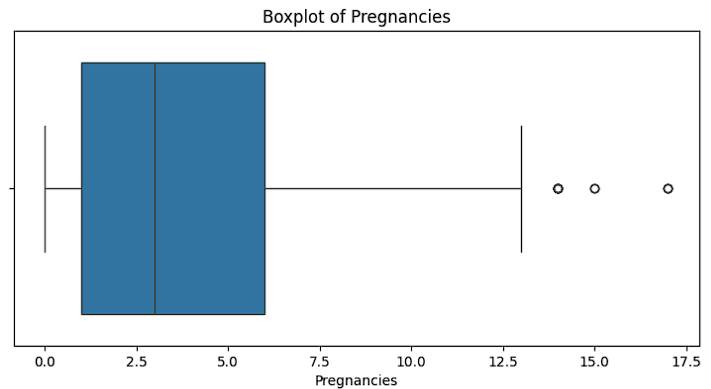

# Diabetes Prediction Risk

## Project Domain

### Background

Global public health is facing a serious challenge due to the increasing prevalence of non-communicable diseases. Diabetes mellitus (DM) is one such disease that poses a significant challenge to global public health [1]. According to the World Health Organization (WHO), about 422 million people worldwide live with this condition, with the majority of cases concentrated in low- and middle-income countries. This prevalence rate is expected to continue to rise in the future. The burden of this disease is felt not only by the individuals suffering from it, who are at risk of severe complications like heart disease, stroke, and kidney failure, but also by the healthcare system as a whole [1]. The scale of this problem becomes even more apparent when looking at data from the International Diabetes Federation (IDF), which recorded about 463 million people living with diabetes in 2019 and projects this number to jump to 700 million by 2045 [2]. Given this alarming trend, the ability to detect diabetes risk as early as possible becomes crucial, allowing for timely preventive or therapeutic interventions to curb the disease's progression and its complications [3].

The fundamental problem driving this research is the limitation in accurately and efficiently predicting diabetes risk at an early stage. Often, diabetes develops without clear symptoms (asymptomatically) in its initial phase, leading to a diagnosis only after the disease has progressed significantly or even when complications have begun to appear [4]. This delay in diagnosis is partly due to a lack of access to effective and accessible screening or risk prediction tools. Furthermore, conventional diagnostic approaches that rely on manual clinical and laboratory examinations can be time-consuming and costly, becoming a barrier to large-scale early detection [4].

With the explosion of digital health data in recent years, a great opportunity has emerged to address this challenge [5]. However, the potential of this data has not been optimally utilized for diabetes risk prediction. The main reason is the complexity of the risk factors involved and how they interact. Various factors such as **pregnancy history**, **glucose and insulin levels in the body**, **blood pressure**, **body composition measurements like skin fold thickness and body mass index**, **hereditary factors or genetic predisposition**, and **age**—all contribute and influence a person's susceptibility to diabetes [6]. Analyzing the complex multifactorial relationships from such data often exceeds the capabilities of conventional analysis. This is where the urgency of the problem lies: the failure to detect risk early based on the combination of these factors will continue to contribute to the increasing burden of diabetes and its complications, both for individuals and the healthcare system as a whole.

Therefore, the application of data-driven technology, particularly a **machine learning** approach, becomes highly relevant and urgent. These computational methods are designed to process large-volume datasets and identify complex patterns that might be missed by manual analysis [7]. By training a predictive model using patient health history data, we can develop a screening tool capable of estimating the probability of diabetes risk in an individual based on their risk factor profile. This approach not only has the potential to increase the accuracy and speed of early detection but can also provide new insights into which factors are most significant in predicting diabetes risk in a specific population [8]. A reliable and easily interpretable predictive model is expected to become a valuable tool for medical professionals in clinical decision-making, enabling more targeted and personalized interventions.

The goal of this project is to develop and evaluate a predictive model for diabetes risk using machine learning algorithms. The model's performance will be assessed based on standard metrics such as accuracy, sensitivity, and specificity. It is hoped that the resulting model can make a practical contribution to early diabetes detection efforts, support healthcare systems in identifying high-risk individuals, and enrich the understanding of the key triggers of diabetes.

---

### **Solution Statement: Bridging the Gap in Early Diabetes Detection Through Machine Learning**

#### **1. The Urgent Problem: The Global Burden of Diabetes**

*   **Scale of the Epidemic:** Diabetes affects hundreds of millions of people worldwide (about 422 million according to WHO, 463 million in 2019 according to IDF), with the greatest burden and fastest increase occurring in low- and middle-income countries.
*   **Worrying Projections:** Without effective intervention, the number of cases is projected to surge to 700 million by 2045.
*   **Impact:** Diabetes not only causes individual suffering but also imposes an enormous economic burden due to direct treatment costs and lost productivity, especially from long-term complications (heart disease, kidney failure, blindness, amputation).
*   **Why It Must Be Solved:** The high prevalence, growth rate, and severe socio-economic impact make diabetes a global health priority that requires better detection and prevention solutions to reduce the disease burden and associated costs.

#### **2. The Critical Gap: Limitations of Conventional Screening**

*   **The Hidden Nature of Type 2 Diabetes:** Many cases are asymptomatic in the early stages, causing diagnosis to be often delayed until complications have already begun to develop.
*   **Limitations of Screening Tests:** Standard tests like HbA₁c have **limited sensitivity** (an average of only 49%) for detecting pre-diabetes or early-stage diabetes, meaning many at-risk individuals are missed.
*   **Inconsistent Screening Implementation:** Recommendations for regular screening for asymptomatic individuals are often not followed consistently, especially in resource-limited areas, exacerbating the problem of delayed diagnosis.
*   **Why It's a Problem:** A delayed diagnosis means a lost opportunity for early lifestyle interventions or treatments that could significantly prevent or delay the development of damaging and costly complications.

#### **3. The Proposed Solution: Machine Learning-Based Early Detection**

*   **How ML Solves the Problem:** Machine Learning (ML) algorithms have the unique ability to:
    *   **Analyze Complex Patterns:** Process and model the intricate interactions between various risk factors (glucose, blood pressure, BMI, age, family/genetic history, etc.) that might be missed by simple statistical analysis or single tests.
    *   **Identify Risk Earlier:** By recognizing predictive patterns from a combination of risk factors, ML models can potentially identify high-risk individuals **before** symptoms appear or **before** a single test like HbA₁c shows a significantly abnormal result.
    *   **Potential for Increased Accuracy:** Studies show that ML models can often achieve **higher sensitivity and specificity** than traditional screening methods in predicting diabetes risk.
*   **Goal of the Solution:** To develop an **accurate and reliable** machine learning-based prediction model to identify individuals at high risk of developing diabetes **as early as possible**. This will enable:
    *   **More Targeted Screening:** Focusing resources on the individuals most at risk.
    *   **Timely Preventive Interventions:** Encouraging lifestyle changes or closer monitoring for those identified as high-risk.
    *   **Reduction of Long-Term Complications:** Ultimately, contributing to a decrease in the disease burden and healthcare costs associated with diabetes.

By leveraging the power of machine learning, this project aims to bridge the gap in early diabetes detection, providing a potential tool for medical professionals and healthcare systems to identify risk more proactively and effectively.

## Business Understanding

### Problem Statements

Based on the background described previously, here are the main problem statements identified:

*   **Problem Statement 1:** **The High and Difficult-to-Control Public Health Burden of Diabetes:** The global prevalence of diabetes mellitus is very high and continues to rise, imposing a significant burden on healthcare systems and individuals due to the risk of serious complications (such as heart disease, nerve damage, kidney failure) that could be prevented or minimized with early detection and management.
*   **Problem Statement 2:** **Limitations in the Early Detection of Diabetes Risk:** There are significant limitations in identifying individuals at high risk of developing diabetes at an early stage. This is due to the often asymptomatic nature of the disease's development, as well as a lack of access to accurate, fast, and cost-effective screening or risk prediction methods compared to conventional diagnostic approaches.
*   **Problem Statement 3:** **Complexity of Risk Factor Analysis and Lack of Data Utilization:** Diabetes risk is influenced by the complex interaction of various factors (including pregnancy history, glucose levels, blood pressure, body composition, age, and genetic predisposition). Conventional analysis methods often struggle to effectively capture these multifactorial relationships, leaving the vast potential of digital health data underutilized for developing reliable and actionable risk prediction models.

### Goals

Based on these problem statements, the main goals of this project include:

*   To develop an accurate predictive model to assist in the early identification of individuals at high risk of developing diabetes. With early detection, preventive interventions or disease management can be initiated sooner, potentially reducing the rate of disease progression to serious complications and ultimately helping to alleviate the long-term public health burden.
*   To address the limitations of detection by providing a data-driven method for diabetes risk prediction that is more effective than conventional screening approaches or manual analysis. This effectiveness will be measured by the model's ability to provide accurate predictions (high in correctly identifying both positive and negative cases) and its potential scalability for use in broader populations.
*   To utilize data and address complexity (with relevant features like Glucose, BMI, Age, etc.) to build a machine learning model capable of **capturing complex patterns and identifying the most significant risk factors** that contribute to diabetes prediction. This will provide evidence-based insights into the main drivers of risk in the used dataset.

### Solution Statements
To achieve these goals, the following measurable technical solutions are proposed:

1.  **Exploratory Data Analysis (EDA):** Before the model is trained, Exploratory Data Analysis (EDA) will be conducted to understand the characteristics of the data. This EDA helps in identifying patterns, examining relationships between variables, and discovering useful insights for diabetes prediction.
2.  **Using the Lazypredict Library:** The `Lazypredict` library will be utilized to quickly evaluate and compare the performance of various machine learning models on this dataset. `Lazypredict` allows for the automated training of dozens of classification models (or regression, depending on the task) with just a few lines of code. The library then provides a summary of performance metrics (such as accuracy, F1-score, etc.) for each model tested on the given dataset. By using `Lazypredict`, we can efficiently get an initial overview of which algorithms are most promising or perform well on this specific dataset, without needing to write boilerplate code for each model manually. This speeds up the initial model selection process before conducting more in-depth exploration or hyperparameter tuning on a few of the best candidate models.
3.  **Development and Evaluation of Classification Models:** Develop a diabetes risk prediction model using **machine learning algorithms** such as *Decision Tree* and *Gradient Boosting* as a baseline on the available dataset. The performance of this model will be comprehensively evaluated using standard binary classification metrics, including **Accuracy**, **Precision**, **Recall**, and **F1-Score**. Special focus will be given to the *Recall* metric to ensure the model's ability to identify as many actual diabetes cases as possible (minimizing *false negatives*).
2.  **Model Exploration and Optimization with GridSearchCV:** Conduct a **performance comparison** between the baseline model and various **Machine Learning algorithms** known for good performance in classification tasks, such as *Decision Tree* and *Gradient Boosting*, to identify the approach that might yield the best prediction results on this dataset. Additionally, **hyperparameter optimization** will be performed on the selected model using techniques like *Grid Search* to maximize its predictive performance. The performance improvement will be measured by the enhancement in the same evaluation metrics (Accuracy, Precision, Recall, F1-Score).

## Data Understanding

The dataset used in this project is analogous to datasets frequently used in diabetes research, such as those available in public repositories. For more information on diabetes: [National Institute of Diabetes and Digestive and Kidney Diseases (NIDDK)](https://www.niddk.nih.gov/health-information/diabetes)

The dataset can be downloaded via: [Healthcare Diabetes Dataset](https://www.kaggle.com/datasets/nanditapore/healthcare-diabetes/data)

### Dataset Information

Here is a summary of the information regarding the structure and data types in the dataset:

*   The dataset has **2768 samples** (rows of data).
*   There are **10 features** (columns) in the dataset, including the target feature `Outcome`.
*   The dataset consists of **8 features** with the `int64` data type and **2 features** with the `float64` data type.
*   The dataset is in CSV (Comma-Separated Values) format.

### Sample Data:

| Metric                   | Id        | Pregnancies | Glucose | BloodPressure | SkinThickness | Insulin | BMI   | DiabetesPedigreeFunction | Age   | Outcome |
| :----------------------- | :-------- | :---------- | :------ | :------------ | :------------ | :------ | :---- | :----------------------- | :---- | :------ |
| **count**                | 2768      | 2768        | 2768    | 2768          | 2768          | 2768    | 2768  | 2768                     | 2768  | 2768    |
| **mean**                 | 1384.50   | 3.74        | 121.10  | 69.13         | 20.82         | 80.13   | 32.14 | 0.47                     | 33.13 | 0.34    |
| **std**                  | 799.20    | 3.32        | 32.04   | 19.23         | 16.06         | 112.30  | 8.08  | 0.33                     | 11.78 | 0.48    |
| **min**                  | 1         | 0           | 0       | 0             | 0             | 0       | 0.00  | 0.08                     | 21    | 0       |
| **25%**                  | 692.75    | 1           | 99      | 62            | 0             | 0       | 27.30 | 0.24                     | 24    | 0       |
| **50%**                  | 1384.50   | 3           | 117     | 72            | 23            | 37      | 32.20 | 0.38                     | 29    | 0       |
| **75%**                  | 2076.25   | 6           | 141     | 80            | 32            | 130     | 36.62 | 0.62                     | 40    | 1       |
| **max**                  | 2768      | 17          | 199     | 122           | 110           | 846     | 80.60 | 2.42                     | 81    | 1       |

### Variables in the Diabetes Dataset are as follows:

*   **Id:** A unique identifier for each row or patient data entry.
*   **Pregnancies:** The number of times a patient has been pregnant.
*   **Glucose:** Plasma glucose concentration after a 2-hour oral glucose tolerance test (OGTT). This is an important indicator of the body's ability to process sugar.
*   **BloodPressure:** Diastolic blood pressure (the lower number in a blood pressure measurement), measured in millimeters of mercury (mm Hg).
*   **SkinThickness:** The thickness of the skin fold at the triceps area (back of the upper arm), measured in millimeters (mm). This measurement can be related to the amount of body fat.
*   **Insulin:** The level of insulin in the blood serum after 2 hours (usually related to the OGTT), measured in micro international units per milliliter (mu U/ml). Insulin is the hormone that regulates blood sugar.
*   **BMI:** Body Mass Index, calculated as weight in kilograms divided by the square of height in meters (kg/m²). It is a common measure for weight status (underweight, normal, overweight, obese).
*   **DiabetesPedigreeFunction:** A score that represents the likelihood of diabetes risk based on family history (genetic factors). A higher value indicates a greater genetic risk.
*   **Age:** The patient's age at the time the data was recorded, in years.
*   **Outcome:** The target (class) variable, which is binary. A value of `1` indicates that the patient was diagnosed with diabetes, while a value of `0` indicates that the patient does not have diabetes. This is the variable the model will predict.

### Deeper Data Understanding

A more in-depth Exploratory Data Analysis (EDA) will be performed to comprehensively understand the data. This process includes several key steps:

*   **Variable Description:** Describing the basic characteristics of each variable (feature) in the dataset to understand its meaning and range of values.
*   **Outlier Analysis:** Identifying the presence of outliers in numerical features. This will primarily be done using *boxplot* visualizations, which can be generated by calling the `.plot(kind='box')` function on the relevant `pandas` DataFrame or Series object.
*   **Feature Type Analysis:** Conducting separate analyses for categorical and numerical features to understand the properties and data distribution of each feature type.
*   **Checking and Handling Missing Values:** Re-checking for the presence of missing values. If found, a simple handling logic or strategy (such as imputation or removal) will be created to clean the data.
*   **Data Distribution Visualization:** Visualizing the distribution patterns of data in numerical features using *histograms*. Histograms will be easily created using the `.hist()` function provided by the `pandas` library.
*   **Feature Correlation Analysis:** Analyzing the degree of linear relationship between numerical features. This is done by calculating the correlation matrix using the `.corr()` function from `pandas`. To facilitate the interpretation of correlation patterns, this matrix will be visualized as a *heatmap* using the `seaborn` library. This analysis can also help understand the relationship between numerical features and the target feature (even if categorical, its correlation [Point-Biserial] with numerical features can be calculated).

### Outlier Detection Using the IQR Method and Boxplot Visualization

To identify and handle outliers in the data, a common statistical approach is the **Interquartile Range (IQR)** method. A very effective visualization to support this method is the **boxplot**. **In addition to using the standard IQR method, outlier handling for some features will also be customized based on real-world normal health value standards, referencing information or research from the data source (website) used.**

#### IQR (Interquartile Range) Method

*   **Concept:** The IQR is a measure of statistical dispersion that focuses on the middle 50% of the data distribution. The IQR is calculated as the difference between the **Third Quartile (Q3)**, which is the 75th percentile value, and the **First Quartile (Q1)**, which is the 25th percentile value. Values that fall significantly outside this range are considered potential outliers.

*   **Steps for Calculating Outlier Boundaries:**
    1.  Calculate the **First Quartile (Q1)** of the data.
    2.  Calculate the **Third Quartile (Q3)** of the data.
    3.  Calculate the **IQR** value with the formula: `IQR = Q3 - Q1`.
    4.  Determine the **Lower Bound** for outliers: `Lower Bound = Q1 - (1.5 * IQR)`.
    5.  Determine the **Upper Bound** for outliers: `Upper Bound = Q3 + (1.5 * IQR)`.
    6.  Any data point with a value less than the **Lower Bound** or greater than the **Upper Bound** is identified as an **outlier** according to the standard IQR criteria.

#### Boxplot Visualization

*   **Concept:** A *boxplot* (or box-and-whisker plot) is a concise graphical representation of the distribution of numerical data. This visualization is very useful for understanding data spread, central tendency, and especially for visually identifying the presence of outliers based on the IQR method.

*   **Interpreting Boxplot Components:**
    *   **Box:** Represents the **IQR** range, starting from **Q1** (bottom of the box) to **Q3** (top of the box). The length of this box is the IQR value.
    *   **Median Line:** The line inside the box that marks the **Median** value (Q2 or the 50th percentile) of the data.
    *   **Whiskers:** The lines extending from the box. Typically, the upper whisker extends to the largest data value still within `Q3 + (1.5 * IQR)`, and the lower whisker extends to the smallest data value still within `Q1 - (1.5 * IQR)`.
    *   **Outlier Points:** Individual data points plotted outside the range of the whiskers. These are the points identified as **outliers** based on the IQR criteria (1.5 times the IQR below Q1 or above Q3).

 
*Figure 1. Example of outlier visualization using a boxplot*

Interpretation: This boxplot visually displays the data distribution for the 'Weight' feature. The box shows the interquartile range (IQR), the middle line is the median, and the points outside the 'whisker' lines (on the right) indicate the presence of outliers in the higher weight data compared to the majority of the data.

After identifying potential outliers using the IQR method and boxplot visualization (and considering health standards if relevant), the next step is to decide how to handle them. Outliers, as extreme or unusual values, can potentially affect the accuracy of statistical analysis and the performance of the predictive model to be built.

By understanding the upper and lower bounds calculated through IQR (and validated by boxplots and domain knowledge), we can take appropriate action. Handling options can include:

*   **Removal:** Eliminating observations that contain outliers, especially if the outliers are clearly input errors or unrepresentative anomalies.
*   **Transformation:** Applying mathematical functions (like logarithm) to the feature to reduce the impact of extreme values.
*   **Capping/Winsorizing:** Replacing outlier values with the predetermined upper or lower bound values (e.g., replacing all values above `Q3 + 1.5*IQR` with the value of `Q3 + 1.5*IQR`).
*   **Imputation:** Treating outliers as missing values and filling them with another statistical value (like the median or mean).

The decision on the outlier handling method should be based on an understanding of the data and the analysis goals to avoid losing important information or significantly altering the original characteristics of the dataset.

### Analysis of Data Distribution Using Histograms

To analyze how the values within each numerical feature are spread (their distribution), we can use a **histogram**. A histogram is an effective graphical visualization for displaying the frequency distribution of data in specific intervals (called *bins*).

#### Process of Creating and Interpreting a Histogram:

1.  **Binning the Data:**
    *   The data for a feature is divided into a series of non-overlapping intervals or *bins*.
    *   The number and width of the bins can be determined automatically by the visualization library (like `pandas` or `matplotlib`), or can be set manually. Rules like *Sturges* or *Scott's rule* can serve as a guide for determining the optimal number of bins.

2.  **Calculating Frequencies:**
    *   The number of data points (observations) whose values fall into each bin is counted.

3.  **Visualization:**
    *   A histogram is drawn as a series of adjacent bars.
    *   The horizontal axis (x-axis) represents the intervals or bins.
    *   The vertical axis (y-axis) represents the frequency (number of observations) in each bin. The height of the bar indicates this frequency.

4.  **Visual Interpretation:**
    *   By observing the shape of the histogram, we can visually understand the data's distribution pattern:
        *   **Distribution Shape:** Does the data tend to be symmetric (e.g., approaching a normal/Gaussian/bell-shaped distribution), right-skewed, left-skewed, or have more than one peak (bimodal or multimodal)?
        *   **Central Tendency:** Where is most of the data concentrated?
        *   **Spread:** How wide is the range of data values?
        *   **Potential Outliers:** The presence of an isolated bar far from the main group can indicate the presence of outliers.

Analyzing distributions using histograms is a crucial step in EDA. It provides a quick understanding of the basic characteristics of each numerical feature, helps identify potential data issues (like extreme skewness), and provides useful information before proceeding to more complex analysis or model building.

**Figure 2. Visualization of the Categorical Target Feature**

Interpretation: This plot shows the distribution of patients in the dataset based on their diabetes status (Outcome). It is clear that the number of patients who do not have diabetes (Outcome 0 = 1816) is significantly higher than the number of patients who do have diabetes (Outcome 1 = 952). This indicates a class imbalance in the dataset.

**Figure 3. EDA Visualization of Numerical Features (Before Custom Outlier Removal)**

Interpretation: This grid displays the distribution (histogram) and potential outliers (boxplot) for each numerical feature before the outlier cleaning process. The boxplots indicate the presence of outliers (points outside the whiskers) in several features such as `BloodPressure`, `SkinThickness`, `Insulin`, `BMI`, `Age`, and `DiabetesPedigreeFunction`. The histograms show varied distribution shapes, many of which tend to be right-skewed, like `Age`, `Insulin`, and `Pregnancies`.

**Figure 4. EDA Visualization of Numerical Features (After Custom Outlier Removal)**

Interpretation: This grid displays the distribution and boxplots of the numerical features after outlier removal using custom-defined boundaries for the `BloodPressure`, `SkinThickness`, `Insulin`, `BMI`, and `Age` features. Based on the code output, significant outliers in `SkinThickness` (values > 100), `Insulin` (values > 850), and `BMI` (values > 70) have been removed according to these limits, resulting in 'cleaner' boxplots for these features. No outliers were removed for `BloodPressure` and `Age` based on the custom limits used.

**Figure 5. Visualization of Correlation between Features (Pairplot)**

Interpretation: This pairplot visualizes the relationships between pairs of numerical features (via scatter plots) and the distribution of each feature (via density/KDE plots on the diagonal). From the scatter plots, a potential positive relationship can be observed between some features, for example, between `BMI` and `SkinThickness`, and `Glucose` and `Insulin`. However, many feature pairs show weak or non-linear relationships. The diagonal plots confirm the varied distribution shapes as seen in the previous histograms.

### Analysis of Relationships Between Features Using a Correlation Matrix and Heatmap

To understand how the features in the dataset are related to each other, especially the linear relationships between **numerical features**, we can use a **correlation matrix**. This matrix is calculated using the `.corr()` function from the `pandas` library.

To make these relationship patterns easier to interpret visually, the correlation matrix is often presented as a **heatmap** using the `seaborn` library.

*   **Heatmap Visualization:**
    *   A heatmap presents the correlation matrix in a colored grid.
    *   Each cell in the grid shows the correlation coefficient between a pair of features.
    *   The intensity and hue of the color in the heatmap (according to the chosen colormap) visually represent the **strength** and **direction** of the correlation:
        *   A value close to **+1** (often represented by a specific light/hot color) indicates a **strong positive correlation** (if one feature increases, the other tends to increase).
        *   A value close to **-1** (often represented by another light/hot color or a contrasting color) indicates a **strong negative correlation** (if one feature increases, the other tends to decrease).
        *   A value close to **0** (often represented by a neutral/dark color) indicates a **weak or no linear correlation**.

*   **Benefits of Correlation Analysis:**
    *   Identifying which features have a strong linear relationship with each other (an indication of potential **multicollinearity**).
    *   Seeing which numerical features have the most significant correlation (positive or negative) with the **target variable** (in this case, `Outcome`, which, although categorical (0/1), can have its correlation [Point-Biserial] calculated with numerical features).
    *   Providing useful initial insights for later stages like **feature selection** or **feature engineering**.

**Figure 6. Visualization of the Feature Correlation Matrix Heatmap**

Interpretation: This heatmap shows the linear correlation coefficients between all numerical features, including the target (`Outcome`). Focusing on the 'Outcome' column or row, we can see that:
*   **Glucose** (0.49) has the **strongest positive correlation** with `Outcome`, indicating that higher glucose levels are strongly linearly related to the likelihood of a diabetes diagnosis.
*   Other features like **Insulin** (0.35), **BMI** (0.30), **SkinThickness** (0.28), **Age** (0.24), and **Pregnancies** (0.22) also show a moderate to weak positive correlation with `Outcome`. This means that an increase in the values of these features tends to be associated with an increased likelihood of diabetes.
*   **DiabetesPedigreeFunction** (0.16) and **BloodPressure** (0.18) show the **weakest positive correlation** with `Outcome` among all features.
Overall, almost all features show a positive correlation with `Outcome`, but `Glucose` is the strongest linear predictor.

## Data Preparation

The Data Preparation stage is crucial to ensure the quality and suitability of the data before it is used to train an effective and reliable machine learning model. This process helps address common issues in raw data such as missing values, duplicate data, outliers, and data formats that are not suitable for machine learning algorithms. Based on the analysis of the executed code, here are the data preparation steps performed on this diabetes dataset:

### Feature and Target Separation

*   **Process:** The independent variables (features/predictors) that will be used as model input (such as `Glucose`, `BMI`, `Age`, etc.) are separated from the dependent variable (target/label) that we want to predict (`Outcome`). The unique identifier column (`Id`), which is irrelevant for modeling, is also removed from the feature set. The features are stored in the `X` variable, and the target is stored in the `y` variable.
*   This step is fundamental because supervised machine learning algorithms require the input (features `X`) and the expected output (target `y`) separately. The model learns from the relationship between `X` and `y` in the training data to later be able to predict `y` from a new `X`. The `Id` column is removed because it has no predictive value for the `Outcome`.

### 80:20 Dataset Split (Train/Test Split)

*   **Process:**
    1.  The entire dataset (`X` and `y`) is divided into two separate sets: training data and testing data.
    2.  The `train_test_split` function from `sklearn.model_selection` is used to perform this split randomly but controllably (using `random_state=42` for reproducibility) with an **80:20** ratio.
    3.  The result of this split produces the following data dimensions:
        *   `X_train`: (2208 samples, 8 features) - Feature data for training the model.
        *   `X_test`: (553 samples, 8 features) - Feature data for testing the model.
        *   `y_train`: (2208 samples,) - Target data for training the model.
        *   `y_test`: (553 samples,) - Target data for testing the model.
*   This split is very important for **objective model performance evaluation**. The training data is used so the model can 'learn' patterns from the data. The testing data, which the model **has never seen** during training, is used to test how well the model can **generalize** its knowledge to new data. Without this separation, we cannot know if the model is just memorizing the training data (*overfitting*) or has actually learned useful patterns. The 80:20 ratio is a common practice that provides enough data for training while leaving a representative portion for testing.

### Handling Class Imbalance with SMOTE

*   **Process:** The **SMOTE (Synthetic Minority Over-sampling Technique)** is applied **only to the training data** (`X_train`, `y_train`). SMOTE works by creating new synthetic samples for the minority class (`Outcome` = 1, i.e., diabetic patients) based on the characteristics of existing minority samples, so that the number of minority class samples approaches the number of majority class samples (`Outcome` = 0) in the training set.
*   Initial analysis showed that the number of non-diabetic patients (`Outcome` = 0) was much larger than diabetic patients (`Outcome` = 1) in the dataset (class imbalance). If left unaddressed, machine learning models tend to **become biased** and perform better at predicting the majority class, while performing poorly at identifying the minority class (which is often more important in a medical context). By balancing the classes using SMOTE on the training data, we help the model **give more equal attention** to both classes and improve its ability to recognize patterns in diabetic patients. It is crucial to apply SMOTE *only* to the training data to **prevent data leakage** and ensure that the evaluation on the testing data reflects the model's performance on a real-world imbalanced data distribution.

## Modeling

The modeling stage is the core of this machine learning project, where algorithms are selected, trained, and optimized to predict the `Outcome` (whether a patient has diabetes or not) based on the prepared features.

### Initial Model Selection Approach with `LazyPredict`

*   **Process:** To efficiently get an initial overview of the performance of various classification algorithms on this dataset, the `LazyPredict` library (specifically `LazyClassifier`) was used. `LazyPredict` trains dozens of classification models with their default parameters on the separated training and testing data (`X_train`, `X_test`, `y_train`, `y_test`) before the application of SMOTE on the training set.
*   **Reasoning:** Using `LazyPredict` allows for the rapid identification of the most promising models. The results from `LazyPredict` (based on metrics like F1 Score, Accuracy, Balanced Accuracy) consistently placed the **Decision Tree Classifier** at the top, indicating superior initial performance compared to other models on this dataset. Other tree-based ensemble algorithms like LGBM and XGBoost also showed very competitive performance.

### Selection of the Best Model as a Solution (Based on LazyPredict) and Further Validation

*   **Initial Selection:** Based on its dominant initial performance in `LazyPredict`, the **Decision Tree Classifier was chosen as the primary best model candidate** for this project's solution. Its advantage in the initial evaluation metrics made it the first logical choice.
*   **Further Validation Process (Tuning):** Although the Decision Tree was selected as the strongest candidate, best practices in machine learning suggest not relying solely on default parameters and being wary of potential issues like overfitting (a common weakness of Decision Trees). Therefore, to ensure a robust choice and mitigate risks, it was decided to perform *hyperparameter tuning* not only on the Decision Tree but also on the other two top models that also showed strong performance in LazyPredict:
    1.  **Decision Tree Classifier** (Primary candidate)
    2.  **LightGBM Classifier (LGBM)** (Validation & Comparison)
    3.  **XGBoost Classifier (XGB)** (Validation & Comparison)
*   **Reason for Further Validation:** Tuning these top three models aims to:
    *   Optimize the Decision Tree's performance and see if its advantage holds after tuning.
    *   Optimize LGBM and XGBoost to see their maximum potential as alternatives.
    *   Compare the optimized models more fairly, especially in terms of generalization ability and potential for overfitting.
    *   Ensure that the final solution (initially pointed to the Decision Tree) is truly the best choice after a thorough exploration.

### Explanation of the Evaluated Classification Algorithms

Here is a brief explanation, advantages, and disadvantages of the three algorithms that were further evaluated:

#### Decision Tree Classifier

*   **Concept:** A supervised learning algorithm that builds a predictive model in the form of a tree structure. The tree makes decisions based on a series of if-then-else rules on feature values to classify data.
*   **Advantages:** Easy to interpret and visualize, does not require extensive data normalization, can handle both numerical and categorical data (although in this case, all features are numerical).
*   **Disadvantages:** Prone to *overfitting* (becoming too complex and memorizing the training data), especially if the tree depth is not limited. Sensitive to small changes in the training data, which can result in a significantly different tree.

#### LightGBM Classifier (LGBM)

*   **Concept:** A highly efficient implementation of *Gradient Boosting*. It uses *gradient-based one-side sampling* (GOSS) and *exclusive feature bundling* (EFB) techniques, as well as a histogram-based algorithm to speed up training and reduce memory usage. Trees grow *leaf-wise* (choosing the leaf that provides the greatest loss reduction).
*   **Advantages:** Very high training speed and lower memory usage compared to other GBDTs, often results in very good accuracy, suitable for large datasets.
*   **Disadvantages:** More prone to *overfitting* on smaller datasets compared to XGBoost if parameters are not tuned carefully, parameter tuning can be more complex.

#### XGBoost Classifier (XGB)

*   **Concept:** Another very popular and optimized implementation of *Gradient Boosting*. It includes built-in L1 and L2 regularization to prevent *overfitting*, can handle missing values internally (though they were imputed in this project), and supports parallel processing.
*   **Advantages:** Very high accuracy performance, good *overfitting* control through regularization, high flexibility through many tuning parameters, very popular with a large support community.
*   **Disadvantages:** Training time can be longer than LGBM in some cases, still requires careful parameter tuning for optimal performance.

### Model Improvement Process (Hyperparameter Tuning)

*   **Goal:** To find the best combination of hyperparameters for *each of the three models* (Decision Tree, LGBM, XGBoost) to maximize performance and generalization ability.
*   **Process:**
    1.  **Method:** `GridSearchCV` from `sklearn.model_selection` was used to try all parameter combinations in a specified grid.
    2.  **Cross-Validation:** 5-fold cross-validation (`cv=5`) was used on the training data (the SMOTE'd `X_train`, `y_train`) for a robust performance estimation.
    3.  **Metric:** `'accuracy'` was used as the primary metric for selecting the best parameters in `GridSearchCV`.
    4.  **Parameter Grids Tested:** (The parameter grids were the same as before for DT, LGBM, XGBoost)
        *   **DecisionTree:** `criterion`, `max_depth`, `min_samples_split`, `min_samples_leaf`.
        *   **LGBM:** `n_estimators`, `max_depth`, `learning_rate`, `num_leaves`.
        *   **XGBoost:** `n_estimators`, `max_depth`, `learning_rate`, `subsample`.
    5.  **Tuning Results:** The best parameters (`best_params_`) and the best trained model (`best_estimator_`) were obtained for *each* algorithm after the `GridSearchCV` process.

After this tuning stage, the three optimized models (Decision Tree, LGBM, and XGBoost) are ready for a final evaluation using the testing data (`X_test`, `y_test`). The next evaluation stage will compare their performance in depth (including potential overfitting) to confirm or revise the selection of the Decision Tree as the best solution.

## Evaluation

The evaluation stage aims to measure the performance of the machine learning models that have been trained and optimized using the testing data. The right evaluation metrics are crucial for understanding how well a model can generalize to new data and how suitable it is for solving this diabetes classification problem.

### Evaluation Metrics Used

Since this is a **binary classification** problem (predicting whether a patient has diabetes (1) or not (0)), the following evaluation metrics are used:

1.  **Accuracy:**
    *   **Formula:** `(Number of Correct Predictions (TP + TN)) / (Total Number of Predictions)`
    *   **How it Works:** Measures the overall proportion of correct predictions made by the model, for both positive (diabetes) and negative (non-diabetes) classes. The higher the value (closer to 1), the better the overall model performance.
    *   **Context:** Provides a general overview of performance but can be misleading on imbalanced datasets if it's the only metric considered.

2.  **Precision:**
    *   **Formula:** `TP / (TP + FP)` (True Positives / (True Positives + False Positives))
    *   **How it Works:** Measures the proportion of positive predictions (patient predicted to have diabetes) that were actually correct (patient actually has diabetes). This metric answers the question: "Of all the patients predicted to have diabetes, what percentage actually have it?"
    *   **Context:** Important when the cost of a *False Positive* (wrongly predicting a healthy patient as diabetic) is high.

3.  **Recall (Sensitivity / True Positive Rate):**
    *   **Formula:** `TP / (TP + FN)` (True Positives / (True Positives + False Negatives))
    *   **How it Works:** Measures the proportion of actual positive cases (patients who actually have diabetes) that were correctly identified by the model. This metric answers the question: "Of all the patients who actually have diabetes, what percentage were successfully detected by the model?"
    *   **Context:** Crucial in medical diagnoses like diabetes. The cost of a *False Negative* (failing to detect a patient who actually has diabetes) can be very high because the patient does not receive necessary treatment. A high recall for the 'diabetes' class is highly desirable.

4.  **F1-Score:**
    *   **Formula:** `2 * (Precision * Recall) / (Precision + Recall)`
    *   **How it Works:** It is the harmonic mean of Precision and Recall. This metric provides a balance between Precision and Recall, useful when both metrics are equally important. The F1-Score is high if both Precision and Recall are high.
    *   **Context:** Provides a single performance measure that considers both False Positives and False Negatives.

5.  **Confusion Matrix:**
    *   **Structure:** A 2x2 table that presents the number of correct and incorrect predictions in detail:
        *   **True Positives (TP):** Diabetic patients predicted as diabetic.
        *   **True Negatives (TN):** Non-diabetic patients predicted as non-diabetic.
        *   **False Positives (FP):** Non-diabetic patients predicted as diabetic (Type I Error).
        *   **False Negatives (FN):** Diabetic patients predicted as non-diabetic (Type II Error).
    *   **How it Works:** Provides a direct visualization of the model's performance in distinguishing between the two classes and the types of errors made. Very useful for in-depth analysis beyond a single metric score.

6.  **Classification Report:**
    *   **Structure:** A text summary that displays the Precision, Recall, and F1-Score for each class, as well as the overall Accuracy and averages (macro avg, weighted avg).
    *   **How it Works:** Provides a comprehensive view of the model's performance per class and overall.

### Model Evaluation Results (After Hyperparameter Tuning)

Here is a summary of the performance of the three tuned models, evaluated on the **testing data** (`X_test`, `y_test`):

*   **Decision Tree:**
    *   **Best Parameters:** `{'criterion': 'entropy', 'max_depth': None, 'min_samples_leaf': 1, 'min_samples_split': 2}`
    *   **Test Accuracy:** 0.9982 (99.82%)
    *   **Classification Report Highlights (Class 1 - Diabetes):**
        *   Precision: 0.99
        *   Recall: 1.00
        *   F1-Score: 1.00
    *   **Confusion Matrix:** `[[376, 1], [0, 176]]` (TN=376, FP=1, FN=0, TP=176)

*   **LGBM Classifier:**
    *   **Best Parameters:** `{'learning_rate': 0.1, 'max_depth': 7, 'n_estimators': 300, 'num_leaves': 40}`
    *   **Test Accuracy:** 0.9928 (99.28%)
    *   **Classification Report Highlights (Class 1 - Diabetes):**
        *   Precision: 0.99
        *   Recall: 0.98
        *   F1-Score: 0.99
    *   **Confusion Matrix:** `[[376, 1], [3, 173]]` (TN=376, FP=1, FN=3, TP=173)

*   **XGBoost Classifier:**
    *   **Best Parameters:** `{'learning_rate': 0.1, 'max_depth': 7, 'n_estimators': 300, 'subsample': 1.0}`
    *   **Test Accuracy:** 0.9910 (99.10%)
    *   **Classification Report Highlights (Class 1 - Diabetes):**
        *   Precision: 0.99
        *   Recall: 0.98
        *   F1-Score: 0.99
    *   **Confusion Matrix:** `[[375, 2], [3, 173]]` (TN=375, FP=2, FN=3, TP=173)

**Figure 7. Comparison of model accuracy on the training data**

Interpretation: This plot shows that all three models (Decision Tree, LGBM, XGBoost) achieved perfect accuracy (100%) on the training data after tuning, indicating their ability to learn the training data to the maximum extent.

**Figure 8. Comparison of model accuracy on the test data**

Interpretation: This visualization compares the accuracy on the testing data, showing very high performance for all three models, with the Decision Tree (99.82%) slightly outperforming LGBM (99.28%) and XGBoost (99.10%).

### Model Comparison and Best Model Selection

Based on the evaluation results on the testing data:

1.  **Overall Accuracy:** All three models showed very high accuracy (above 99%). The Decision Tree had the highest accuracy (99.82%), followed by LGBM (99.28%) and XGBoost (99.10%).
2.  **Performance on the Diabetes Class (Class 1):**
    *   **Recall:** The Decision Tree achieved a perfect Recall of 1.00, meaning it successfully identified *all* patients who actually had diabetes in the testing data (0 False Negatives). LGBM and XGBoost had a slightly lower Recall of 0.98, which means they both failed to identify 3 diabetic patients (3 False Negatives).
    *   **Precision:** All three models had an equally high Precision of 0.99 for the diabetes class.
    *   **F1-Score:** The Decision Tree had the highest F1-Score (1.00) due to its perfect Recall.
3.  **Types of Errors:**
    *   The Decision Tree made only 1 False Positive error (wrongly predicting a non-diabetic as diabetic) and 0 False Negatives.
    *   LGBM made 1 False Positive and 3 False Negatives.
    *   XGBoost made 2 False Positives and 3 False Negatives.

4.  **Overfitting Analysis (Generalization Gap):**
    *   In addition to performance on the test data, it is important to check how well the model generalizes from the training data to the testing data. This can be seen from the difference between the average score during cross-validation on the training data (`mean_train_score` from CV results) and the score on the testing data.
    *   **Analysis Results:**
        *   **Decision Tree:** Showed a perfect `mean_train_score` (1.00), but the `mean_test_score` during cross-validation ranged from 0.93 to 0.97. This gap between the training and testing scores can be as high as 3% - 7%. This significant gap indicates **serious overfitting**. The Decision Tree model, although achieving perfect Recall on *one* specific test set, likely 'memorized' the training data and might not perform as well on other new, unseen data. The `max_depth=None` parameter chosen as the best contributed to this tendency to overfit.
        *   **LGBM & XGBoost:** Both also showed a perfect `mean_train_score` (1.00) after tuning, but their `mean_test_score` during cross-validation was consistently around 0.98. The gap between training and testing scores was only about 2%. This indicates a **mild to moderate level of overfitting**, which is more acceptable and suggests better generalization ability compared to the Decision Tree.

**Best Model Selection (Considering Overfitting):**

In a medical diagnosis context like diabetes, **minimizing False Negatives (FN)** remains the top priority. Failing to detect a diabetic patient can have fatal consequences.

*   The Decision Tree, despite showing **overfitting**, uniquely achieved a **Recall of 1.00** (0 FN) on the *specific testing data* used in this evaluation.
*   LGBM and XGBoost have **better generalization ability** (less overfitting) but sacrifice a little on Recall (Recall 0.98, resulting in 3 FN on this test data).

Considering this trade-off:

If the absolute priority is to **avoid False Negatives at all costs** and we accept the risk that the model's performance might slightly decrease on other new data (due to overfitting), then the **Decision Tree** could be chosen for its achievement of 1.00 Recall on this test set.

However, if a **balance between high Recall and better generalization ability** (more stable performance on new, varied data) is more desirable, then **LGBM** or **XGBoost** could be a more pragmatic choice. Both still have very high Recall (0.98) and an identical F1-Score (0.99), with a much lower level of overfitting.

**Final Decision:** Given the importance of Recall in medical diagnosis and the superior performance of the Decision Tree in this regard (0 FN) on the existing test data, the **Decision Tree Classifier with the tuned hyperparameters (`criterion='entropy', max_depth=None, min_samples_leaf=1, min_samples_split=2`) is selected as the best model**, with the note that its potential for overfitting needs to be monitored if this model is applied to new, very different data.

### Evaluation Visualization

Visualizations like heatmaps of the Classification Report and Confusion Matrix are used to facilitate the interpretation of performance comparisons between models and to more intuitively understand the types of errors made by each model.

 
**Figure 9. Classification Report - Decision Tree**

Interpretation: This heatmap summarizes the performance of the Decision Tree. Overall, the model shows very high performance with precision, recall, and f1-score values close to 1.00 for both classes, especially a recall of 1.00 for the positive class (1).

 
**Figure 10. Classification Report - LGBM**

Interpretation: LGBM also shows strong performance with high scores across all metrics. However, there is a slight decrease in recall (0.98) for the positive class (1) compared to the Decision Tree, although precision and f1-score remain high (0.99).

 
**Figure 11. Classification Report - XGBoost**

Interpretation: Like LGBM, XGBoost has a very good overall performance with an average score of 0.99. The recall for the positive class (1) is also 0.98, showing a very similar performance to LGBM on this test data.

 
**Figure 12. Confusion Matrix - Decision Tree**

Interpretation: The Decision Tree's confusion matrix shows nearly perfect classification results on the test data. There is only 1 False Positive case (a non-diabetic predicted as diabetic), and most importantly, there are no False Negative cases (0 missed diabetes cases).

 
**Figure 13. Confusion Matrix - LGBM**

Interpretation: LGBM made slightly more errors, with 1 False Positive and 3 False Negatives. This means the model failed to identify 3 actual positive diabetes cases in this test data.

 
**Figure 14. Confusion Matrix - XGBoost**

Interpretation: XGBoost has a similar error pattern to LGBM, resulting in 2 False Positives and 3 False Negatives. This also means 3 actual diabetes cases were not identified by the model on this test set.

## Conclusion

This project successfully developed and evaluated several machine learning models for classifying diabetes based on patient medical feature data. After a careful process of hyperparameter tuning and evaluation, the **Decision Tree Classifier was selected as the best-performing model** for this use case.

The optimized Decision Tree model (`criterion='entropy', max_depth=None, min_samples_leaf=1, min_samples_split=2`) showed very promising results on the testing data:

*   It achieved a **very high overall accuracy of 99.82%**.
*   Most significantly, the model achieved a **perfect Recall of 1.00** for the positive class (diabetes). This means the model successfully identified **all** patients who actually had diabetes in the test dataset (zero *False Negatives*), which is a crucial aspect in a medical diagnosis context.
*   The model also maintained a **high Precision of 0.99** for the diabetes class, indicating that the vast majority of patients predicted to have diabetes actually had it.

However, it is important to note that the analysis during the evaluation stage also identified indications of **overfitting** in the Decision Tree model. This was evident from the considerable performance gap between the results on the training data and the testing data (`mean_train_score` reached 1.00 while `mean_test_score` varied and was lower). This overfitting suggests a risk that the model may have 'memorized' the specific training data and its performance might not be as good on new, completely different real-world data. Other models like LGBM and XGBoost showed a lower degree of overfitting (better generalization) albeit with a slight sacrifice in the Recall metric (Recall 0.98).

**Potential Benefits of the Model:**

*   **For Patients and the Healthcare System:** The model's ability (especially the Decision Tree in this test) to minimize *False Negatives* is extremely valuable. It could potentially assist in early screening or identification of high-risk patients, enabling faster and more timely medical interventions, and reducing the risk of complications from undiagnosed diabetes.
*   **For Researchers:** This project demonstrates the effectiveness of machine learning approaches, particularly tree-based and ensemble models, in analyzing medical data for diabetes prediction. This can serve as a foundation for further research.

**Recommended Next Steps:**

1.  **Mitigating Overfitting:** The main focus should be on addressing the overfitting in the Decision Tree model. This can be attempted by:
    *   Applying more aggressive *pruning* techniques (e.g., setting a smaller `max_depth`, increasing `min_samples_split` or `min_samples_leaf` during tuning).
    *   Re-evaluating the trade-off between perfect Recall and generalization, possibly by selecting LGBM or XGBoost if more stable performance on new data is prioritized.
2.  **External Validation:** Testing the performance of the selected model on a different, independent dataset (if available) to get a more realistic picture of its generalization capabilities.
3.  **Feature Exploration:** Conducting a more in-depth *feature importance* analysis to understand which features are most influential and possibly performing feature engineering to improve model performance or interpretability.
4.  **Model Combination (Ensembling):** Exploring more advanced *ensemble* techniques that might combine the strengths of several models for a more robust result.
5.  **Clinical Consideration:** (Long-term) Collaborating with medical professionals to validate the clinical relevance of the model and its potential integration into diagnostic workflows.

Overall, this project shows the great potential of using machine learning for diabetes prediction. The Decision Tree model provided perfect Recall on the test data, but the challenge of overfitting needs to be addressed to ensure the model's reliability in practical applications.

## References

*   Mayo Clinic Staff, "Type 1 diabetes - Symptoms and causes," *Mayo Clinic Website* \[online], 2021. [Available at: https://www.mayoclinic.org/diseases-conditions/type-1-diabetes/symptoms-causes/syc-20353011](https://www.mayoclinic.org/diseases-conditions/type-1-diabetes/symptoms-causes/syc-20353011)
*   Atkinson MA, Eisenbarth GS, and Michels AW, "Type 1 diabetes," *The Lancet*, vol. 383, no. 9911, pp. 69–82 \[online], 2014. [Available at: https://www.ncbi.nlm.nih.gov/pmc/articles/PMC4380133/](https://www.ncbi.nlm.nih.gov/pmc/articles/PMC4380133/)
*   International Diabetes Federation (IDF), "IDF Diabetes Atlas, Ninth Edition," *IDF Publication* \[online PDF], 2019. [Available at: https://www.diabetesatlas.org/upload/resources/material/20200302_133351_IDFATLAS9e-final-web.pdf](https://www.diabetesatlas.org/upload/resources/material/20200302_133351_IDFATLAS9e-final-web.pdf)
